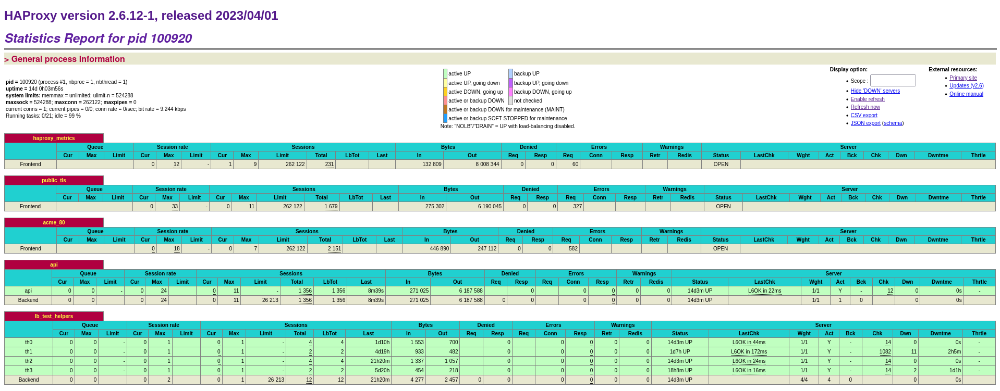
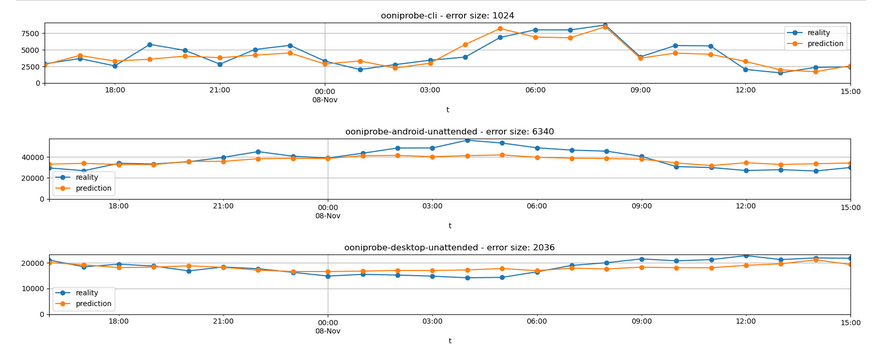

# Backend documentation
This document describes the architecture of the main components of the
OONI infrastructure.

How to develop, test, deploy and monitor them.

The documentation is meant for core contributors.

If you are reading this document as a MarkDown file on github the
following button on the top-right menu provides a table of content:


## Progress report (to be deleted when finished)
> **important**
> TODO

-   ✓ Create basic general structure

-   ✓ Prepare a diagram of the main data flow

-   ✓ log management and Vector

-   ✓ summarize systemd timers

-   ✓ deployer tool

-   ✓ Github CI workflows

    -   ✓ [debops-ci tool](#debops-ci-tool)<sub><sup> </sup></sub>🔧

    -   ✓ Debian repo basic structure

    -   ✓ package build

        -   ✓ versioning

    -   ✓ Code [Code documentation generation](#code-documentation-generation) this is a link
        test [fixme](#code-documentation-generation)

    -   ✓ Mypy

    -   ✓ Fastpath

    -   ✓ API

        -   ✓ app

        -   ✓ auth

        -   ✓ database

        -   ✓ incidents

        -   ❏ measurements

        -   ✓ measurement feedback

        -   ✓ ooni_api_uploader

        -   ✓ oonirun

        -   ✓ prio

        -   ✓ private

        -   ❏ probe_services

        -   ✓ rate_limit_quotas

        -   ✓ urlparams

        -   ✓ utils

        -   ✓ views

-   ❏ describe components not written by ooni

    -   ✓ [Grafana](#grafana)<sub><sup> </sup></sub>🔧 overview

        -   ✓ Describe the most useful dashboards in
            <https://grafana.ooni.org/> what charts are useful for
            troubleshooting

    -   ✓ [Haproxy](#haproxy)<sub><sup> </sup></sub>⚙

    -   ✓ [Nginx](#nginx)<sub><sup> </sup></sub>⚙

    -   ✓ [Dehydrated](#dehydrated)<sub><sup> </sup></sub>⚙

    -   ✓ [Ansible](#ansible)<sub><sup> </sup></sub>🔧

    -   ✓ [Prometheus](#prometheus)<sub><sup> </sup></sub>🔧

    -   ✓ [Grafana](#grafana)<sub><sup> </sup></sub>🔧

    -   ✓ [Etckeeper](#etckeeper)<sub><sup> </sup></sub>🔧

    -   ✓ [ClickHouse intance for logs](#clickhouse-intance-for-logs)<sub><sup> </sup></sub>⚙

    -   ❏ [CitizenLab test list
        updater](#comp:citizenlab_test_lists_updater)

    -   ❏ [ClickHouse](#clickhouse)<sub><sup> </sup></sub>⚙

    -   ✓ [Jupyter Notebook](#jupyter-notebook)<sub><sup> </sup></sub>🔧

-   ❏ Describe the contents of the <https://github.com/ooni/backend/> in
    the master branch. Focus on:

    -   ❏ [Fastpath](#fastpath)<sub><sup> </sup></sub>⚙

    -   ❏ [API](#api)<sub><sup> </sup></sub>⚙

        -   ❏ [API](#api)<sub><sup> </sup></sub>⚙

            -   ❏ <https://github.com/ooni/backend/issues/761>

            -   ❏ Where the tor targets (bridges and directory
                authorities) are stored to be given to probes

            -   ❏ How you can update the tor targets to include or
                exclude certain entries

    -   ❏ [analysis package](#analysis-package)<sub><sup> </sup></sub>📦 package containing various
        timer that update fingerprints, CitizenLab etc

    -   ❏ test helper rotation

-   ❏ Describe the software deployment process and provide examples

    -   ❏ CI build process

    -   ❏ deployment steps and how to do rollbacks

    -   ❏ monitoring during deployment

    -   ❏ basics on how to do OS updates

-   ❏ Provide examples of troubleshooting backend issues using logs

-   ❏ Provide examples of adding features or making changes

    -   ❏ To the API

    -   ❏ To the fastpath

    -   ❏ To other scripts

    -   ❏ To grafana

    -   ❏ Adding grafana alerts

    -   ❏ To jupyter notebooks

-   ❏ Summarize the notebooks on <https://jupyter.ooni.org/> that I use
    more often

-   ❏ Document debugging/metrics scripts manually executed on
    backend-fsn

-   ❏ Document high priority tasks and github issues

-   ❏ Misc

    -   ❏ passwords/keys private repo

## Glossary
A few shorthands used in the document:

-   Backend: the whole software stack including the Fastpath, API, tools
    that transfer data around

-   FSN: The backend-fsn.ooni.org host, running most of the
    **production** backend infrastructure.

-   ams-pg-test: The ams-pg-test.ooni.org host, running a **test**
    backend infrastructure.

# Architecture
The backend infrastructure provides multiple functions:

-   Provide APIs for data consumers

-   Instruct probes on what measurements to perform

-   Receive measurements from probes, process them and store them in the
    database

-   Upload new measurements to a bucket on [S3 data
    bucket](#topic:s3data)

-   Fetch data from external sources e.g. fingerprints from a GitHub
    repository

# Main data flows
This diagram represent the main flow of measurement data.

The rectangles represent processes. The ellipses represent data at rest:
as files on disk, files on S3 or records in database tables.


Ellipses represent data; rectangles represent processes. Click on the
image and then click on each shape to see related documentation.

Probes submit measurements to the API with a POST at the following path:
<https://api.ooni.io/apidocs/#/default/post_report__report_id_> The
measurement is optionally decompressed if zstd compression is detected.
It is then parsed and added with a unique ID and saved to disk. Very
little validation is done at this time in order to ensure that all
incoming measurements are accepted.

Measurements are enqueued on disk using one file per measurement. On
hourly intervals they are batched together, compressed and uploaded to
S3 by the Measurement Uploader. The batching is performed to allow
efficient compression. See the [dedicated subchapter](#measurement-uploader)<sub><sup> </sup></sub>⚙
for details.

The measurement is also sent to the Fastpath. The Fastpath runs as a
dedicated daemon with a pool of workers. It calculates scoring for the
measurement and writes a record in the fastpath table. Each measurement
is processed individually in real time. See the [dedicated
subchapter](#comp:fastpath) below.

The disk queue is also used by the API to access recent measurements
that have not been uploaded to S3 yet. See the [measurement
API](#get_measurement) for details.

## Reproducibility
The measurement processing pipeline is meant to generate outputs that
can be equally generated by 3rd parties like external researchers and
other organizations.

This is meant to keep OONI accountable and as a proof that we do not
arbitrarily delete or alter measurements and that we score them as
accessible/anomaly/confirmed/failure in a predictable and transparent
way.

> **important**
> The only exceptions were due to privacy breaches that required removal
> of the affected measurements from the [S3 data bucket](#s3-data-bucket)<sub><sup> </sup></sub>💡
> bucket.

As such, the backend infrastructure is
[FOSS](https://en.wikipedia.org/wiki/Free_and_open-source_software) and
can be deployed by 3rd parties. We encourage researchers to replicate
our findings.

Incoming measurements are minimally altered by the [Measurement
uploader](#comp:uploader) and uploaded to S3.

# Conventions
Usually backend components have names that are kept consistent across:

-   Journald unit name

-   Systemd service name

-   Systemd timer name

-   StatsD metrix prefix

When linking to the backend codebase a [specific
commit](https://github.com/ooni/backend/blob/0ec9fba0eb9c4c440dcb7456f2aab529561104ae/)
is used in order to avoid breaking links when the codebase changes.

Internal links across the document are indicated with small icons to
visualize the type of element they are linking to, as commonly done in
technical wikis. E.g. abstract topics use \"💡\", backend components
\"⚙\", Grafana dashboards \"📊\"

# Application metrics
All components of the backend are designed to output application
metrics.

Metrics are prefixed with the name of each application. The metrics are
used in [Grafana](#grafana)<sub><sup> </sup></sub>🔧 for charts, monitoring and alarming.

They use the StatsD protocol over UDP using localhost as destination.
This guarantees that applications never block on metric generation in
case the receiver slows down. The StatsD messages are received by
[Netdata](#netdata)<sub><sup> </sup></sub>🔧. It automatically tracks any new metric,
generates averages and summaries as needed and exposes it to
[Prometheus](#prometheus)<sub><sup> </sup></sub>🔧 for scraping.

Application metrics data flow:


Ellipses represent data; rectangles represent processes. Purple
components belong to the backend. Click on the image and then click on
each shape to see related documentation.

In Python the statsd library is used e.g.:

    metrics = statsd.StatsClient("localhost", 8125, prefix="ooni-api")

[Prometheus](#tool:prometheus) and [Grafana](#grafana)<sub><sup> </sup></sub>🔧 provide
historical charts for more than 90 days and are useful to investigate
long-term trends.

[Netdata](#netdata)<sub><sup> </sup></sub>🔧 provides a web UI with real-time metrics. See
the dedicated subchapter for details.

## Prometheus
Prometheus <https://prometheus.io/> is a popular monitoring system and
runs on [monitoring.ooni.org](#monitoring.ooni.org)<sub><sup> </sup></sub>🖥

It is deployed and configured by [Ansible](#ansible)<sub><sup> </sup></sub>🔧 using the
following playbook:
<https://github.com/ooni/sysadmin/blob/master/ansible/deploy-monitoring.yml>

Most of the metrics are collected by scraping Prometheus endpoints,
Netdata, and using node exporter.

## Grafana dashboards
There is a number of dashboards on [Grafana](#grafana)<sub><sup> </sup></sub>🔧 at
<https://grafana.ooni.org/>

[Grafana](#grafana)<sub><sup> </sup></sub>🔧 is deployed on the monitoring.ooni.org host. It
is deployed and configured by [Ansible](#ansible)<sub><sup> </sup></sub>🔧 using the
following playbook:
<https://github.com/ooni/sysadmin/blob/master/ansible/deploy-monitoring.yml>
This also includes the credentials to access the Web UI

The dashboards are used for:

-   Routinely reviewing the general health of the backend infrastructure

-   Predicting long-term scaling requirements, i.e.

-   increasing disk space for the database

-   increasing CPU and memory requirements

-   Investigating alerts and troubleshooting incidents

### Alerting
Alerts from [Grafana](#tool:grafana) and [Prometheus](#prometheus)<sub><sup> </sup></sub>🔧
are sent to the #ooni-bots Slack channel
<https://app.slack.com/client/T37Q8EGUU/C38EJ0CET> by a bot. Slack can
be configured to provide desktop notification from browsers and audible
notifications on smartphones.

Alert flow:


The alert rules are listed at <https://grafana.ooni.org/alerting/list>
The list also shows which alerts are firing at the moment, if any. There
is also a handful of alerts configured in [Prometheus](#prometheus)<sub><sup> </sup></sub>🔧
using [Ansible](#ansible)<sub><sup> </sup></sub>🔧.

The silences list shows if any alert has been temporarily silenced:
<https://grafana.ooni.org/alerting/silences>

There are also many dashboards and alerts configured in [Jupyter
Notebook](#tool:jupyter). These are meant for metrics that require more
complex algorithms, predictions and SQL queries that cannot be
implemented using [Grafana](#grafana)<sub><sup> </sup></sub>🔧.

On many dashboards you can set the averaging timespan and the target
hostname using fields on the top left.

Here is an overview of the most useful dashboards:

### API and fastpath
<https://grafana.ooni.org/d/l-MQSGonk/api-and-fastpath-multihost?orgId=1&var-avgspan=1h&var-host=backend-fsn.ooni.org>

This is the most important dashboard showing the metrics of the
[API](#comp:api) and the [Fastpath](#fastpath)<sub><sup> </sup></sub>⚙.

### Test-list repository in the API
<https://grafana.ooni.org/d/siWZslSVk/api-test-list-repo?orgId=1>

Shows timings around the git repository checked out by the
[API](#api)<sub><sup> </sup></sub>⚙ that contains the test lists.

### Measurement uploader dashboard
<https://grafana.ooni.org/d/ma3Q6GzVz/api-uploader?orgId=1>

Metrics, timing and data transferred by the [Measurement
uploader](#comp:uploader)

### Fingerprint updater dashboard
<https://grafana.ooni.org/d/JNlK8ox4z/fingerprints?orgId=1&from=now-12h&to=now&refresh=5m>

Metrics and timing from the [Fingerprint
updater](#comp:fingerprints_updater)

### ClickHouse dashboard
<https://grafana.ooni.org/d/thEkJB_Mz/clickhouse?orgId=1>

ClickHouse-specific performance metrics

### Haproxy dashboard
<https://grafana.ooni.org/d/ba33e4df-d686-4459-b37d-3966af14ad00/haproxy?orgId=1>

Basic metrics from [Haproxy](#haproxy)<sub><sup> </sup></sub>⚙ load balancers

### TLS certificate dashboard
<https://grafana.ooni.org/d/-1mr7sWMk/ssl-certificates?orgId=1&from=now-7d&to=now&refresh=5s>

Certificate expiration times. There are alerts configured in
[Grafana](#grafana)<sub><sup> </sup></sub>🔧 to alert on expiring certificates.

### Database backup dashboard
<https://grafana.ooni.org/d/aQjQYhoGz/db-backup?orgId=1>

Metrics, timing and data transferred by [Database backup
tool](#comp:db_backup)

### Event detector dashboard
<https://grafana.ooni.org/d/FH2TmwFVz/event-detection?orgId=1&refresh=1m>

Basic metrics from the [social media blocking event
detector](#comp:detector)

### GeoIP MMDB database dashboard
<https://grafana.ooni.org/d/0e6eROj7z/geoip?orgId=1&from=now-7d&to=now>

Age and size of the GeoIP MMDB database. Also, a chart showing
discrepancies between the GeoIP lookup performed by the probes VS the
one in the API, used to gauge the benefits of using a centralized
solution.

### Host clock offset dashboard
<https://grafana.ooni.org/d/9dLa-RSnk/host-clock-offset?orgId=1>

Measures NTP clock sync and alarms on big offsets

### Netdata-specific dashboard
<https://grafana.ooni.org/d/M1rOa7CWz/netdata?orgId=1&var-instance=backend-fsn.ooni.org:19999>

Shows all the metrics captured by [Netdata](#netdata)<sub><sup> </sup></sub>🔧 - useful for
in-depth performance investigation.

### ASN metadata updater dashboard
<https://grafana.ooni.org/d/XRihZL-Vk/ansmeta-update?orgId=1&from=now-7d>

Progress, runtime and table size of the [ASN metadata
updater](#comp:asnmeta_updater)

# Log management
All components of the backend are designed to output logs to Systemd's
journald. They usually log using the component name as unit name.
Sometimes you might have to use `--identifier <name>` instead.

Journald automatically indexes logs by time, unit name and other items.
This allows to quickly filter logs during troubleshooting, for example:

    sudo journalctl -u ooni-api --since '10 m ago'

Or follow live logs using e.g.:

    sudo journalctl -u nginx -f

Sometimes it is useful to show milliseconds in the timestamps:

    sudo journalctl -f -u ooni-api -o short-precise

The logger used in Python components also sets additional fields,
notably CODE_FUNC and CODE_LINE

Available fields can be listed using:

    sudo journalctl -f -u ooni-api  -N | sort

It is possible to filter by those fields. It comes very handy for
debugging e.g.:

    sudo journalctl -f -u ooni-api CODE_FUNC=open_report

Every host running backend services also sends host to
monitoring.ooni.org using [Vector](#vector)<sub><sup> </sup></sub>🔧.


There is a dedicated ClickHouse instance on monitoring.ooni.org used to
collect logs. See the [ClickHouse intance for logs](#clickhouse-intance-for-logs)<sub><sup> </sup></sub>⚙.
This is done to avoid adding unnecessary load to the production database
on FSN that contains measurements and also keep a copy of FSN's logs on
a different host.

The receiving [Vector](#vector)<sub><sup> </sup></sub>🔧 instance and ClickHouse are
deployed and configured by [Ansible](#ansible)<sub><sup> </sup></sub>🔧 using the following
playbook:
<https://github.com/ooni/sysadmin/blob/master/ansible/deploy-monitoring.yml>

# Systemd timers
Some backend components like the API and Fastpath run as daemons. Many
other run as Systemd timers at various intervals.

The latter approach ensures that a component will start again at the
next time interval even if the previous run crashed out. This provides a
moderate reliability benefit at the expense of having to perform
initialization and shutdown at every run.

To show the existing timers and their next start time run:

    systemctl list-timers

# Summary of timers
Here is a summary of the most important timers used in the backend:

    UNIT                           ACTIVATES
    dehydrated.timer               dehydrated.service
    detector.timer                 detector.service
    ooni-api-uploader.timer        ooni-api-uploader.service
    ooni-db-backup.timer           ooni-db-backup.service
    ooni-download-geoip.timer      ooni-download-geoip.service
    ooni-rotation.timer            ooni-rotation.service
    ooni-update-asn-metadata.timer ooni-update-asn-metadata.service
    ooni-update-citizenlab.timer   ooni-update-citizenlab.service
    ooni-update-fingerprints.timer ooni-update-fingerprints.service

Ooni-developed timers have a matching unit file with .service extension.

To show the existing timers and their next start time run:

    systemctl list-timers

This can be useful for debugging.

## Dehydrated timer
Runs the Dehydrated ACME tool, see [Dehydrated](#dehydrated)<sub><sup> </sup></sub>⚙

is a simple script that provides ACME support for Letsencrypt. It's
integrated with Nginx or Haproxy with custom configuration or a small
script as \"glue\".

## Detector timer
Runs the [social media blocking event detector](#social-media-blocking-event-detector)<sub><sup> </sup></sub>⚙.

## ooni-api-uploader timer
Runs the [Measurement uploader](#measurement-uploader)<sub><sup> </sup></sub>⚙. It is installed by the
[analysis package](#analysis-package)<sub><sup> </sup></sub>📦.

## ooni-db-backup timer
Runs the [Database backup tool](#database-backup-tool)<sub><sup> </sup></sub>⚙ Also installed by the
[analysis package](#analysis-package)<sub><sup> </sup></sub>📦.

## ooni-download-geoip timer
Fetches GeoIP databases, installed by the [ooni-api](#api)<sub><sup> </sup></sub>⚙.

Monitored with the [GeoIP dashboard](#geoip-mmdb-database-dashboard)<sub><sup> </sup></sub>📊

## ooni-rotation timer
Runs the test helper rotation script, installed by the [analysis
package](#pkg:analysis).

## ooni-update-asn-metadata timer \[\[timer:
Fetches ASN metadata, installed by the [analysis
package](#pkg:analysis).

## ooni-update-citizenlab
Fetches CitizenLab data from GitHub, installed by the [analysis
package](#pkg:analysis).

## ooni-update-fingerprints
Fetches fingerprints from GitHub, installed by the [analysis
package](#pkg:analysis).

# API
The API provides entry points used by the probes,
[Explorer](https://explorer.ooni.org/), the [Test List
Editor](https://test-lists.ooni.org/) and other UIs, and researchers.

Entry points under `/api/v1/` are meant for public consumption and
versioned. Those under `/api/_/` are for internal use.

The API is versioned. Access is rate limited based on source IP address
and access tokens. See [Rate limiting and quotas](#rate-limiting-and-quotas)<sub><sup> </sup></sub>🐝 for
details.

due to the computational cost of running heavy queries on the database.
The API entry points are documented at
[apidocs](https://api.ooni.io/apidocs/) using
[flasgger](https://flasgger.pythonanywhere.com/). A swagger JSON
specification is published at <https://api.ooni.io/apispec_1.json>

The file is also tracked at
<https://github.com/ooni/backend/blob/0ec9fba0eb9c4c440dcb7456f2aab529561104ae/api/docs/apispec.json>
It is checked for consistency by CI in the [API end-to-end
test](#topic:e2e-test), see
<https://github.com/ooni/backend/blob/0ec9fba0eb9c4c440dcb7456f2aab529561104ae/.github/workflows/test_new_api.yml#L27>

To regenerate the spec file when implementing changes to the API use:
<https://github.com/ooni/backend/blob/0ec9fba0eb9c4c440dcb7456f2aab529561104ae/api/tools/check_apispec_changes>

Before diving into the API codebase it's worth glancing at commonly used
functions:

URL parameter parsing utilities at
<https://github.com/ooni/backend/blob/0ec9fba0eb9c4c440dcb7456f2aab529561104ae/api/ooniapi/urlparams.py>

Caching functions `cachedjson` and `nocachejson` at
<https://github.com/ooni/backend/blob/0ec9fba0eb9c4c440dcb7456f2aab529561104ae/api/ooniapi/utils.py#L18>

Various database access functions `query_click`, `insert_click` at
<https://github.com/ooni/backend/blob/0ec9fba0eb9c4c440dcb7456f2aab529561104ae/api/ooniapi/database.py#L73>

API routes are mounted at:
<https://github.com/ooni/backend/blob/0ec9fba0eb9c4c440dcb7456f2aab529561104ae/api/ooniapi/database.py#L73>

Functions related to initialization of the service and configurating
rate limiting:
<https://github.com/ooni/backend/blob/0ec9fba0eb9c4c440dcb7456f2aab529561104ae/api/ooniapi/app.py>

> **note**
> Caching can be a source of bugs: enabling or disabling it explicitly in
> the codebase (instead of relying on defaults in Nginx/Haproxy) improves
> readability.

> **important**
> Various queries are designed to support active/standby or active/active
> database setups. See [Overall design](#overall-design)<sub><sup> </sup></sub>💡 for details.

## API cache
The API uses cacheing functions provided by [Nginx](#nginx)<sub><sup> </sup></sub>⚙.

Caching functions `cachedjson` and `nocachejson` are defined at
<https://github.com/ooni/backend/blob/0ec9fba0eb9c4c440dcb7456f2aab529561104ae/api/ooniapi/utils.py#L18>

## Auth
This module implements browser authentication and user accounts. See
[Probe services](#probe-services)<sub><sup> </sup></sub>🐝 for probe authentication.

It is designed to fit the following requirements:

-   Never store users email address centrally nor IP addresses nor
    passwords

-   Verify email to limit spambots. Do not use CAPCHAs or other 3rd
    party services

-   Support multiple sessions and multiple devices, ability to register
    multiple times

-   Do not leak the existence of absence of accounts for a given email
    address

Workflow:

-   To register the UIs call
    <https://api.ooni.io/apidocs/#/default/post_api_v1_user_register>
    using an email address and the user receives a temporary login link
    by email

-   Upon clicking on the link the UIs call
    <https://api.ooni.io/apidocs/#/default/get_api_v1_user_login> and
    receive a long-lived JWT in a cookie

-   The UIs call any API entry point sending the JWT cookie

-   The UIs call
    <https://api.ooni.io/apidocs/#/default/get_api_v1_user_refresh_token>
    as needed to refresh the JWT

The API als provides entry points to:

-   Get account metadata
    <https://api.ooni.io/apidocs/#/default/get_api___account_metadata>

-   Get role for an existing account
    <https://api.ooni.io/apidocs/#/default/get_api_v1_get_account_role__email_address_>

-   Set account roles
    <https://api.ooni.io/apidocs/#/default/post_api_v1_set_account_role>

-   Expunge sessions (see below)
    <https://api.ooni.io/apidocs/#/default/post_api_v1_set_session_expunge>

Browsers sessions can be expunged to require users to log in again. This
can be used if an account role needs to be downgraded or terminated
urgently.

> **important**
> Account IDs are not the same across test and production instances.

This is due to the use of a configuration variable
`ACCOUNT_ID_HASHING_KEY` in the hashing of the email address. The
parameter is read from the API configuration file. The values are
different across deployment stages as a security feature.

Also see [Creating admin API accounts](#creating-admin-api-accounts)<sub><sup> </sup></sub>📒 for more
details.

[Sources](https://github.com/ooni/backend/blob/0ec9fba0eb9c4c440dcb7456f2aab529561104ae/api/ooniapi/auth.py)

## Measurements
This module primarily provides entry points to access measurements,
typically used by Explorer and sometimes directly by users.

Mounted under `/api/v1/measurement/`

[Sources](https://github.com/ooni/backend/blob/0ec9fba0eb9c4c440dcb7456f2aab529561104ae/api/ooniapi/measurements.py)

### Searching for measurements
The entry point
<https://api.ooni.io/apidocs/#/default/get_api_v1_measurements> provides
measurement searching and listing.

It is primarily used by <https://explorer.ooni.org/search>

### Getting measurement bodies
Various API entry points allow accessing measurement bodies. Typically
the lookup is done by `measurement_uid`:

-   <https://api.ooni.io/apidocs/#/default/get_api_v1_measurement__measurement_uid_>

-   <https://api.ooni.io/apidocs/#/default/get_api_v1_raw_measurement>

-   <https://api.ooni.io/apidocs/#/default/get_api_v1_measurement_meta>

For legacy reasons measurements can also be accessed by `report_id` +
`input` instead of `measurement_uid`

> **important**
> Accessing measurements by `report_id` + `input` does not guarantee
> uniqueness.

The lookup process can access measurement bodies from multiple
locations. The lookup is performed in different order for different
measurements based on the likelihood of success:

-   Scan the local spool directory
    `/var/lib/ooniapi/measurements/incoming/` for fresh measurements

-   Scan other API hosts (if any) for fresh measurements. This is
    required to support active/active backend deployments.

-   Lookup the measurement data in [jsonl table](#jsonl-table)<sub><sup> </sup></sub>⛁ and then
    fetch the required [JSONL files](#jsonl-files)<sub><sup> </sup></sub>💡 from [S3 data
    bucket](#topic:s3data) and extract the content.

#### Performance considerations
Fetching data from the [S3 data bucket](#s3-data-bucket)<sub><sup> </sup></sub>💡 bucket can be
resource-intensive. However:

-   Very recent measurements are likely to be found in the local on-disk
    queue instead of having to fetch them from S3. See [Measurement
    uploader](#comp:uploader) for details.

-   Frequently accessed measurements benefit from the [API
    cache](#topic:apicache).

-   Measurement bodies are rarely accessed. The overall amount of
    measurements is too large for users to explore a significant
    fraction through the web UIs.

Possible improvements are:

-   Compress JSONL files using <https://github.com/facebook/zstd> with
    high compression rates

-   Use a seekable format and store the measurement location in the
    JSONL file in the [jsonl table](#jsonl-table)<sub><sup> </sup></sub>⛁ expressed in bytes. See
    <https://github.com/facebook/zstd/blob/dev/contrib/seekable_format/README.md>

<https://github.com/ooni/backend/blob/0ec9fba0eb9c4c440dcb7456f2aab529561104ae/api/ooniapi/measurements.py>

### Measurement feedback
This part of the API is used to collect and serve user feedback on
measurements. It uses [msmt_feedback table](#msmt_feedback-table)<sub><sup> </sup></sub>⛁ and
provides:

-   Getting feedback for an existing measurement
    <https://api.ooni.io/apidocs/#/default/get_api>**measurement_feedback*measurement_uid*

-   Submitting new feedback
    <https://api.ooni.io/apidocs/#/default/post_api___measurement_feedback>

All users can access feedbacks but only authenticated ones can submit
their feedbacks.

Users can submit only one feedback for each measurement. When the
submission entry point is called a second time for the same measurements
the previous feedback is overwritten using database row deduplication.

Valid feedback statuses are:

    blocked
    blocked.blockpage
    blocked.blockpage.http
    blocked.blockpage.dns
    blocked.blockpage.server_side
    blocked.blockpage.server_side.captcha
    blocked.dns
    blocked.dns.inconsistent
    blocked.dns.nxdomain
    blocked.tcp
    blocked.tls
    ok
    down
    down.unreachable
    down.misconfigured

[Sources](https://github.com/ooni/backend/blob/0ec9fba0eb9c4c440dcb7456f2aab529561104ae/api/ooniapi/measurements.py)

## Aggregation and MAT
The aggregation API leverages the OLAP features of
[ClickHouse](#clickhouse)<sub><sup> </sup></sub>⚙ to provide summaries and statistics on
measurements. It is primarily used by the
[MAT](https://explorer.ooni.org/chart/mat). It can also be used to
implement other statistics in Explorer or accessed directly by
researchers to extract data.

[Aggregation entry
point](https://api.ooni.io/apidocs/#/default/get_api_v1_aggregation)

[Sources](https://github.com/ooni/backend/blob/0ec9fba0eb9c4c440dcb7456f2aab529561104ae/api/ooniapi/aggregation.py)

> **important**
> Caching of this entry point should be implemented carefully as new
> measurements are constantly being inserted and old measurements might be
> occasionally reprocessed.

## Probe services
This part of the API serves lists of collectors and test helpers to the
probes and receive measurements from them.

> **important**
> TODO

[Sources](https://github.com/ooni/backend/blob/0ec9fba0eb9c4c440dcb7456f2aab529561104ae/api/ooniapi/probe_services.py)

Mounted under /api/v1/

[Sources](https://github.com/ooni/backend/blob/0ec9fba0eb9c4c440dcb7456f2aab529561104ae/api/ooniapi/probe_services.py)

### Incident management
The incident management module implements ways for users to create,
update and list incidents.

Related:
<https://docs.google.com/document/d/1TdMBWD45j3bx7GRMIriMvey72viQeKrx7Ad6DyboLwg/>

Accounts with \"admin\" role can perform the same actions as regolar
users and additionally can publish, unpublish and delete incidents.

All the routes related to this module are mounted under
`/api/v1/incidents/`:

-   Search and list incidents:
    <https://api.ooni.io/apidocs/#/default/get_api_v1_incidents_search>

-   Show an incident:
    <https://api.ooni.io/apidocs/#/default/get_api_v1_incidents_show__incident_id_>

-   Create or update an incident:
    <https://api.ooni.io/apidocs/#/default/post_api_v1_incidents__action_>
    Search/list incidents with:

-   Filtering by domain/cc/asn/creator id/ and so on

-   Sort by creation/edit date, event date, and so on

Users can only update/delete incidents created by themselves. Admins can
update/delete everything.

Incidents are stored in the [incidents table](#incidents-table)<sub><sup> </sup></sub>⛁

See
[Sources](https://github.com/ooni/backend/blob/0ec9fba0eb9c4c440dcb7456f2aab529561104ae/api/ooniapi/incidents.py)

### Prioritization
This module implements reactive prioritization for URLs in the test list
served to the probes.

`/api/v1/check-in` and `/api/v1/test-list/urls` provide dynamic URL
tests lists for [Web connectivity test](#web-connectivity-test)<sub><sup> </sup></sub>Ⓣ based on the
CitizenLab URL list and the measurements count from the last 7 days.

The `prio.py` module is used mainly by the [Probe services](#probe-services)<sub><sup> </sup></sub>🐝 API
and secondarily by the `private_api_check_in` method in the [Private
entry points](#api:private).


Ellipses represent data; rectangles represent processes. Purple
components belong to the backend. Click on the image and then click on
each shape to see related documentation.

In the diagram arrows show information flow.

The prioritization system implements a feedback mechanism to provide
efficient coverage of URLs in [Web connectivity test](#web-connectivity-test)<sub><sup> </sup></sub>Ⓣ in
ASNs with low coverage.

Measurements from probes are received by the [API](#api)<sub><sup> </sup></sub>⚙, sent to
the [Fastpath](#fastpath)<sub><sup> </sup></sub>⚙ and then stored in the [fastpath
table](#tbl:fastpath). [ClickHouse](#clickhouse)<sub><sup> </sup></sub>⚙ automatically
updates the [counters_asn_test_list table](#counters_asn_test_list-table)<sub><sup> </sup></sub>⛁
in real time. See the link for details on the table contents.

Later on probes call API entry points like
<https://api.ooni.io/apidocs/#/default/post_api_v1_check_in> and receive
new URLs (inputs) for [Web connectivity test](#web-connectivity-test)<sub><sup> </sup></sub>Ⓣ. The URLs
are ordered according to the priorities set in the [url_priorities
table](#tbl:url_priorities) and the amount of measurements gathered in
the past days from probes in the same ASNs.

[prio.py
sources](https://github.com/ooni/backend/blob/0ec9fba0eb9c4c440dcb7456f2aab529561104ae/api/ooniapi/prio.py)

[private API
sources](https://github.com/ooni/backend/blob/0ec9fba0eb9c4c440dcb7456f2aab529561104ae/api/ooniapi/private.py)

[probe services
sources](https://github.com/ooni/backend/blob/0ec9fba0eb9c4c440dcb7456f2aab529561104ae/api/ooniapi/probe_services.py)

For debugging see
<https://api.ooni.io/apidocs/#/default/get_api___debug_prioritization>

ooniapi/private.py:from ooniapi.prio import generate_test_list

ooniapi/probe_services.py:from ooniapi.prio import generate_test_list

### Priorities and weights
URLs have priorities based on the rules from the [url_priorities
table](#tbl:url_priorities).

Prioritization rules can be viewed and edited by accounts with `admin`
rights on <https://test-lists.ooni.org/prioritization>

The
[compute_priorities](https://github.com/ooni/backend/blob/0ec9fba0eb9c4c440dcb7456f2aab529561104ae/api/ooniapi/prio.py#L102)
function calculates priority and weight for each supplied URL.

Priorities are calculated by matching all the prioritization rules to
each URL in the [citizenlab table](#citizenlab-table)<sub><sup> </sup></sub>⛁. They do not depend
on the amount of past measurements.

Priorities values are relative, e.g. if one URL has a priority of 800
and another one has 200 the first should be measured 4 times more often
than the latter.

The URLs sent to the probes are ordered from the most urgent to the
least urgent by calculating weights as `priority / measurement count`.
This is done with a granularity of a single country code + ASN pair.

Probes start performing [Web connectivity test](#web-connectivity-test)<sub><sup> </sup></sub>Ⓣ from the
top of the list.

You can inspect generated priorities with the [Priorities and weights
notebook](#nb:weights) or using the API at
<https://api.ooni.io/apidocs/>*/default/get_api_v1_test_list_urls or
<https://api.ooni.io/apidocs/>*/default/get_api\_\_\_debug_prioritization
e.g.:

    $ curl -s 'https://api.ooni.io/api/v1/test-list/urls?country_code=IT&probe_asn=3269&debug=True' | jq -S | less

    $ curl -s 'https://ams-pg-test.ooni.org/api/_/debug_prioritization?probe_cc=IT&probe_asn=3269&limit=9999' | jq -S | less

## Private entry points
The `private.py` module provides many entry points not meant for public
consumption. They are not versioned, mounted under `/api/_` and used
exclusively by:

-   [Explorer](https://explorer.ooni.org/)

-   [Test List Editor](https://test-lists.ooni.org/)

Statistics and summaries, mainly for Explorer:

-   <https://api.ooni.io/apidocs/#/default/get_api___asn_by_month>

-   <https://api.ooni.io/apidocs/#/default/get_api___circumvention_runtime_stats>

-   <https://api.ooni.io/apidocs/#/default/get_api___circumvention_stats_by_country>

-   <https://api.ooni.io/apidocs/#/default/get_api___countries>

-   <https://api.ooni.io/apidocs/#/default/get_api___countries_by_month>

-   <https://api.ooni.io/apidocs/#/default/get_api___country_overview>

-   <https://api.ooni.io/apidocs/#/default/get_api___domain_metadata>

-   <https://api.ooni.io/apidocs/#/default/get_api___domains>

-   <https://api.ooni.io/apidocs/#/default/get_api___global_overview>

-   <https://api.ooni.io/apidocs/#/default/get_api___global_overview_by_month>

-   <https://api.ooni.io/apidocs/#/default/get_api___im_networks>

-   <https://api.ooni.io/apidocs/#/default/get_api___im_stats>

-   <https://api.ooni.io/apidocs/#/default/get_api___network_stats>

-   <https://api.ooni.io/apidocs/#/default/get_api___networks>

-   <https://api.ooni.io/apidocs/#/default/get_api___test_coverage>

-   <https://api.ooni.io/apidocs/#/default/get_api___test_names>

-   <https://api.ooni.io/apidocs/#/default/get_api___vanilla_tor_stats>

-   <https://api.ooni.io/apidocs/#/default/get_api___website_networks>

-   <https://api.ooni.io/apidocs/#/default/get_api___website_stats>

-   <https://api.ooni.io/apidocs/#/default/get_api___website_urls>

Misc functions:

-   ASN metadata
    <https://api.ooni.io/apidocs/#/default/get_api___asnmeta>

-   Check uploaded reports
    <https://api.ooni.io/apidocs/#/default/get_api___check_report_id>

For debugging:
<https://api.ooni.io/apidocs/#/default/get_api___quotas_summary> See
[Rate limiting and quotas](#rate-limiting-and-quotas)<sub><sup> </sup></sub>🐝 for details.

> **note**
> There are other entry points under `/api/_` that are not part of this
> module, e.g. [OONI Run](#ooni-run)<sub><sup> </sup></sub>🐝

[Sources](https://github.com/ooni/backend/blob/0ec9fba0eb9c4c440dcb7456f2aab529561104ae/api/ooniapi/private.py)

## Rate limiting and quotas
The API is provided with rate limiting functions and traffic quotas to
provide fair use and protect the database from overloading. It was
initially implemented to protect PostgreSQL used in the past.

The rate limiting is based on multiple usages quotas with monthly,
weekly and daily limits. The limit are applied to `/24` subnets where
HTTP connections are coming from by default, or with a token system for
authenticated accounts. Quotas are stored in
[LMDB](http://www.lmdb.tech/doc/) in order to track the values
consistently across API processes with minimal increase in CPU and I/O
load.

Resource usage can vary widely between different API entry points and
query parameters. In order to account resource consumption both in terms
of CPU and disk I/O quotas are consumed based on the wallclock time
taken to to process each API call. This means that i.e. an API call that
takes 2 seconds consumes 20 times more quota than a call that takes 100
ms.

When any of the monthly, weekly and daily quotas are exceeded users
receive HTTP 429 (Too Many Requests) until quotas are incremented again.
Increments happen every hour.

There's an API call to get a summary of used quotas:
<https://api.ooni.io/api/_/quotas_summary> See [Investigating heavy
aggregation queries runbook](#runb:inv_heavy_queries) for usage
examples.

Configuration for rate limiting is at:
<https://github.com/ooni/backend/blob/0ec9fba0eb9c4c440dcb7456f2aab529561104ae/api/ooniapi/app.py>

[Sources](https://github.com/ooni/backend/blob/0ec9fba0eb9c4c440dcb7456f2aab529561104ae/api/ooniapi/rate_limit_quotas.py)

## OONI Run
This module implements management of OONI Run links.

All the routes related to this module are mounted under
`/api/v1/ooni_run/`:

-   List OONIRun descriptors
    <https://api.ooni.io/apidocs/#/default/get_api___ooni_run_list>

-   Archive an OONIRun descriptor and all its past versions
    <https://api.ooni.io/apidocs/#/default/post_api>**ooni_run_archive*ooni_run_link_id*

-   Create a new oonirun link or a new version for an existing one
    <https://api.ooni.io/apidocs/#/default/post_api___ooni_run_create>

-   Fetch OONIRun descriptor by creation time or the newest one
    <https://api.ooni.io/apidocs/#/default/get_api>**ooni_run_fetch*ooni_run_link_id*

Specifications are published at:
<https://github.com/ooni/spec/blob/master/backends/bk-005-ooni-run-v2.md>

OONI Run links can be updated by sending new translations and new
versions. Each entry is stored as a new database row. The creation entry
point detects if the new submission contains only translation changes.
In that case only updates `translation_creation_time`. Otherwise it also
updates `descriptor_creation_time`.

[Sources](https://github.com/ooni/backend/blob/0ec9fba0eb9c4c440dcb7456f2aab529561104ae/api/ooniapi/oonirun.py)

## Codebase
> **important**
> TODO

    api/ooniapi/citizenlab.py
    api/ooniapi/data.py
    api/ooniapi/errors.py
    api/ooniapi/incidents.py
    api/ooniapi/measurements.py
    api/ooniapi/pages/docs.py
    api/ooniapi/private.py
    api/ooniapi/utils.py
    api/ooniapi/views.py
    api/ooniapi/wsgi.py
    api/tests/conftest.py
    api/tests/functional/test_private_explorer.py
    api/tests/functional/test_probe_services.py
    api/tests/integ/test_aggregation.py
    api/tests/integ/test_citizenlab.py
    api/tests/integ/test_incidents.py
    api/tests/integ/test_integration.py
    api/tests/integ/test_integration_auth.py
    api/tests/integ/test_oonirun.py
    api/tests/integ/test_params_validation.py
    api/tests/integ/test_prioritization.py
    api/tests/integ/test_prioritization_nodb.py
    api/tests/integ/test_private_api.py
    api/tests/integ/test_probe_services.py
    api/tests/integ/test_probe_services_nodb.py
    api/tests/integ/test_rate_limiter.py
    api/tests/integ/test_torsf_stats.py
    api/tests/unit/test_auth.py
    api/tests/unit/test_countries.py
    api/tests/unit/test_oonirun.py
    api/tests/unit/test_prio.py
    api/tests/unit/test_unit.py
    api/tests/utils.py

    api/tools/monitor_test_list.py

## Tor targets
Tor targets are served at path `/api/v1/test-list/tor-targets` They are
read from a configuration file. The path is set in the main
configuration file and it usually is `/etc/ooni/tor_targets.json`.

To make changes in the Tor targets see the runbook [Updating tor
targets](#runb:tor-targets)

# Fastpath
> **important**
> TODO extract existing documentation from codebase

# Test helpers
## Fastpath codebase
> **important**
> TODO

    fastpath/database_upgrade_schema.py
    fastpath/fastpath/core.py
    fastpath/fastpath/db.py
    fastpath/fastpath/__init__.py
    fastpath/fastpath/metrics.py
    fastpath/fastpath/normalize.py
    fastpath/fastpath/reprocessor.py
    fastpath/fastpath/s3feeder.py
    fastpath/fastpath/tests/test_functional_nodb.py
    fastpath/fastpath/tests/test_functional_normalize.py
    fastpath/fastpath/tests/test_functional.py
    fastpath/fastpath/tests/test_unit.py
    fastpath/fastpath/utils.py

## Analysis
Miscellaneous scripts, services and tools. It contains ancilliary
components that are not updated often and might not justify a dedicated
Debian package for each of them.

Deployed using the [analysis package](#analysis-package)<sub><sup> </sup></sub>📦

<https://github.com/ooni/backend/blob/0ec9fba0eb9c4c440dcb7456f2aab529561104ae/analysis/>

Data flows from various updaters:


Ellipses represent data; rectangles represent processes. Purple
components belong to the backend. Click on the image and then click on
each shape to see related documentation.

> **important**
> TODO add alerts

See the subchapters for details:

### CitizenLab test list updater
This component fetches the test lists from
<https://github.com/citizenlab/test-lists> and populates the [citizenlab
table](#tbl:citizenlab) and [citizenlab_flip
table](#tbl:citizenlab_flip).

The git repository <https://github.com/citizenlab/test-lists.git> is
cloned as an unauthenticated user.

Database writes are performed as the `citizenlab` user.

The tables have few constraints on the database side: most of the
validation is done in the script and it is meant to be strict. The
updater overwrites [citizenlab_flip table](#citizenlab_flip-table)<sub><sup> </sup></sub>⛁ and
then swaps it with [citizenlab table](#citizenlab-table)<sub><sup> </sup></sub>⛁ atomically. In
case of failure during git cloning, verification and table overwrite the
final swap does not happen, leaving the `citizenlab` table unaltered.

It is deployed using the [analysis package](#analysis-package)<sub><sup> </sup></sub>📦 and started
by the [ooni-update-citizenlab](#ooni-update-citizenlab)<sub><sup> </sup></sub>⏲ Systemd timer.

Logs are generated as the `analysis.citizenlab_test_lists_updater` unit.

Also it generates the following metrics with the
`citizenlab_test_lists_updater` prefix:

+----------------------+----------------------+-----------------------+
| Metric name          | Type                 | Description           |
+======================+======================+=======================+
| `fetc                | timer                | Fetch duration        |
| h_citizen_lab_lists` |                      |                       |
+----------------------+----------------------+-----------------------+
| `upda                | timer                | Update duration       |
| te_citizenlab_table` |                      |                       |
+----------------------+----------------------+-----------------------+
| `citiz               | gauge                | Table size            |
| enlab_test_list_len` |                      |                       |
+----------------------+----------------------+-----------------------+

The updater lives in one file:
<https://github.com/ooni/backend/blob/0ec9fba0eb9c4c440dcb7456f2aab529561104ae/analysis/analysis/citizenlab_test_lists_updater.py>

To run the updater manually during development:

    PYTHONPATH=analysis ./run_analysis --update-citizenlab --dry-run --stdout

> **important**
> TODO grafana charts and alerts

### Fingerprint updater
This component fetches measurement fingerprints as CSV files from
<https://github.com/ooni/blocking-fingerprints> and populates
[fingerprints_dns table](#fingerprints_dns-table)<sub><sup> </sup></sub>⛁, [fingerprints_dns_tmp
table](#tbl:fingerprints_dns_tmp), [fingerprints_http
table](#tbl:fingerprints_http) and [fingerprints_http_tmp
table](#tbl:fingerprints_http_tmp).

The tables without `_tmp` are used by the [Fastpath](#fastpath)<sub><sup> </sup></sub>⚙.

The CSV files are fetched directly without git-cloning.

Database writes are performed as the `api` user, configured in
<https://github.com/ooni/backend/blob/0ec9fba0eb9c4c440dcb7456f2aab529561104ae/analysis/analysis/analysis.py#L64>

The tables have no constraints on the database side and basic validation
is performed by the script:
<https://github.com/ooni/backend/blob/0ec9fba0eb9c4c440dcb7456f2aab529561104ae/analysis/analysis/fingerprints_updater.py#L91>

The updater overwrites the tables ending with `_tmp` and then swaps them
with the \"real\" tables atomically. In case of failure the final swap
does not happen, leaving the \"real\" tables unaltered.

It is deployed using the [analysis package](#analysis-package)<sub><sup> </sup></sub>📦 and started
by the [ooni-update-citizenlab](#ooni-update-citizenlab)<sub><sup> </sup></sub>⏲ Systemd timer.

Logs are generated as the `analysis.fingerprints_updater` unit.

Also it generates the following metrics with the `fingerprints_updater`
prefix:

+----------------------+----------------------+-----------------------+
| Metric name          | Type                 | Description           |
+======================+======================+=======================+
| `fetch_csv`          | timer                | CSV fetch duration    |
+----------------------+----------------------+-----------------------+
| `fingerpri           | gauge                | Update progress       |
| nts_update_progress` |                      |                       |
+----------------------+----------------------+-----------------------+
| `finge               | gauge                | DNS table size        |
| rprints_dns_tmp_len` |                      |                       |
+----------------------+----------------------+-----------------------+
| `finger              | gauge                | HTTP table size       |
| prints_http_tmp_len` |                      |                       |
+----------------------+----------------------+-----------------------+

See the [Fingerprint updater dashboard](#fingerprint-updater-dashboard)<sub><sup> </sup></sub>📊 on Grafana.

The updater lives primarily in
<https://github.com/ooni/backend/blob/0ec9fba0eb9c4c440dcb7456f2aab529561104ae/analysis/analysis/fingerprints_updater.py>
and it's called by the `analysis.py` script

To run the updater manually during development:

    PYTHONPATH=analysis ./run_analysis --update-citizenlab --dry-run --stdout

### ASN metadata updater
This component fetches ASN metadata from
<https://archive.org/download/ip2country-as> (generated via:
<https://github.com/ooni/historical-geoip>)

It populates the [asnmeta table](#asnmeta-table)<sub><sup> </sup></sub>⛁ and [asnmeta_tmp
table](#tbl:asnmeta_tmp).

[asnmeta table](#tbl:asnmeta) is used by the private [API](#api)<sub><sup> </sup></sub>⚙,
see:
<https://github.com/ooni/backend/blob/0ec9fba0eb9c4c440dcb7456f2aab529561104ae/api/ooniapi/private.py#L923>
and <https://api.ooni.io/apidocs/#/default/get_api___asnmeta>

Database writes are performed as the `api` user, configured in
<https://github.com/ooni/backend/blob/0ec9fba0eb9c4c440dcb7456f2aab529561104ae/analysis/analysis/analysis.py#L64>

The table has no constraints on the database side and basic validation
is performed by the script:
<https://github.com/ooni/backend/blob/0ec9fba0eb9c4c440dcb7456f2aab529561104ae/analysis/analysis/asnmeta_updater.py#L95>

Logs are generated as the `analysis.asnmeta_updater` unit.

Also it generates the following metrics with the `asnmeta_updater`
prefix:

+----------------------+----------------------+-----------------------+
| Metric name          | Type                 | Description           |
+======================+======================+=======================+
| `fetch_data`         | timer                | Data fetch duration   |
+----------------------+----------------------+-----------------------+
| `asnm                | gauge                | Update progress       |
| eta_update_progress` |                      |                       |
+----------------------+----------------------+-----------------------+
| `asnmeta_tmp_len`    | gauge                | table size            |
+----------------------+----------------------+-----------------------+

See the [ASN metadata updater dashboard](#asn-metadata-updater-dashboard)<sub><sup> </sup></sub>📊 on
Grafana.

To run the updater manually during development:

    PYTHONPATH=analysis ./run_analysis --update-asnmeta --stdout

### Database backup tool
The backup tool is a service that regularly backs up
[ClickHouse](#clickhouse)<sub><sup> </sup></sub>⚙ tables to S3. It also exports tables in
`CSV.zstd` format for public consumption.

Contrarily to similar tools, it is designed to:

-   extract data in chunks and upload it without creating temporary
    files

-   without requiring transaction support in the database (not available
    in ClickHouse)

-   without requiring transactional filesystems or interrupting the
    database workload

It is configured by [Ansible](#ansible)<sub><sup> </sup></sub>🔧 using the
`/etc/ooni/db-backup.conf` file. Runs as a SystemD service, see
[ooni-db-backup timer](#ooni-db-backup-timer)<sub><sup> </sup></sub>⏲

It compresses data using <https://facebook.github.io/zstd/> during the
upload.

The tool chunks tables as needed and add sleeps as needed to prevent a
query backlog impacting the database performance.

Logs are generated as the `ooni-db-backup` unit.

Also it generates the following metrics with the `db-backup` prefix:

+----------------------+----------------------+-----------------------+
| Metric name          | Type                 | Description           |
+======================+======================+=======================+
| `upload_to_s3`       | timer                | Data upload duration  |
+----------------------+----------------------+-----------------------+
| `run_export`         | timer                | Data export duration  |
+----------------------+----------------------+-----------------------+
| `table_{tbln         | timer                | Table backup time     |
| ame}_backup_time_ms` |                      | (multiple metrics)    |
+----------------------+----------------------+-----------------------+

See the [Database backup dashboard](#database-backup-dashboard)<sub><sup> </sup></sub>📊 on Grafana.

Monitor with:

    sudo journalctl -f --identifier ooni-db-backup

Future improvements:

-   [private/public backups](https://github.com/ooni/backend/issues/766)

-   [safer table backup
    workflow](https://github.com/ooni/backend/issues/767)

-   [database schema
    backup](https://github.com/ooni/backend/issues/765). For extracting
    the schema see [Database schema check](#database-schema-check)<sub><sup> </sup></sub>💡

### Ancilliary modules
`analysis/analysis/analysis.py` is the main analysis script and acts as
a wrapper to other components.

`analysis/analysis/metrics.py` is a tiny wrapper for the Statsd Python
library.

## Social media blocking event detector
Blocking event detector currently under development. Documented in
<https://docs.google.com/document/d/1WQ6_ybnPbO_W6Tq-xKuHQslG1dSPr4jUbZ3jQLaMqdw/edit>

Deployed by the [detector package](#detector-package)<sub><sup> </sup></sub>📦.

See [Monitor blocking event detections notebook](#monitor-blocking-event-detections-notebook)<sub><sup> </sup></sub>📔 [Event
detector dashboard](#dash:detector) [Detector timer](#detector-timer)<sub><sup> </sup></sub>⏲

## OONI bridges
> **important**
> TODO

## Test helper rotation
The test helper rotation script is responsible for spawning and
deploying VMs on Digital Ocean to be used as [Test
helpers](#comp:test-helpers) The primary functions are:

-   Select datacenters and spawn VMs. This allows having helpers to live
    in many countries, datacenters and subnets making attempts at
    blocking them more difficult.

-   Runs a setup script on the host at first boot

-   Keeps a list of live and old hosts in a dedicated database table

-   Create SSL certificates using the Digital Ocean API

-   Performs end-to-end test on newly created VMs to ensure the test
    helper service is running

-   Update DNS to publish new services

-   Drain and destroy old VMs

It is designed to be extended:

-   Support multiple cloud services. The database tables already contain
    columns to track VMs on different cloud providers.

-   Support deploying [OONI bridges](#ooni-bridges)<sub><sup> </sup></sub>⚙. This can
    provide frequently changing \"entry point\" IP addresses for probes.

The script is deployed on [backend-fsn.ooni.org](#backend-fsn.ooni.org)<sub><sup> </sup></sub>🖥 using the
[analysis deb package](#analysis-package)<sub><sup> </sup></sub>📦

The configuration is deployed using [Ansible](#ansible)<sub><sup> </sup></sub>🔧:

-   `/etc/ooni/rotation.conf`: main configuration file deployed using
    <https://github.com/ooni/sysadmin/blob/master/ansible/roles/ooni-backend/tasks/main.yml>

-   `/etc/ooni/rotation_setup.sh`: this script is executed on the VMs
    for configuration, see
    <https://github.com/ooni/sysadmin/blob/master/ansible/roles/ooni-backend/templates/rotation_nginx_conf>

-   `/etc/ooni/rotation_nginx_conf`: configuration for Nginx to be
    deployed on the VMs, see
    <https://github.com/ooni/sysadmin/blob/master/ansible/roles/ooni-backend/templates/rotation_setup.sh>

Test helpers are named `<number>.th.ooni.org`. This is required to
generate `*.th.ooni.org` certificates.

### Internals
The tool reads /etc/ooni/rotation.conf

It uses the following APIs:

-   Digital Ocean API: DNS A/AAAA records

-   Digital Ocean API: Live droplets

Other stateful data exists only in:

-   test_helper_instances database table

-   \"Let's Encrypt\" SSL certificates for `*.th.ooni.org` temporarily
    stored on local host and pushed to the test helpers

For the database table setup see [test_helper_instances
table](#tbl:test_helper_instances).

Example of /etc/ooni/rotation.conf

    [DEFAULT]
    token = CHANGEME
    active_droplets_count = 4
    size_slug = s-1vcpu-1gb
    image_name = debian-10-x64
    draining_time_minutes = 240
    dns_zone = th.ooni.org

Simple example for /etc/ooni/rotation_setup.sh:

    #!/bin/bash
    # Configure test-helper droplet
    # This script is run as root and with CWD=/
    set -euo pipefail
    exec 1>setup.log 2>&1
    echo "deb [trusted=yes] https://ooni-internal-deb.s3.eu-central-1.amazonaws.com unstable main" > /etc/apt/sources.list.d/ooni.list
    apt-key adv --verbose --keyserver hkp://keyserver.ubuntu.com --recv-keys 'B5A08F01796E7F521861B449372D1FF271F2DD50'
    apt-get update
    apt-get upgrade -qy
    echo > /etc/motd
    apt-get install -qy oohelperd
    apt-get install -qy oohelperd nginx-light

It is activated by the [ooni-rotation timer](#ooni-rotation-timer)<sub><sup> </sup></sub>⏲ Systemd
timer Generates metrix prefixed as `rotation` and logs as a journald
unit named `rotation`.

Related files in the backend repository:

    analysis/rotation.py
    analysis/tests/test_rotation.py

> **warning**
> The script has no access to security-critical credentials for services
> like Namecheap, however it has the ability to spawn VMs and control
> Digital Ocean's DNS.

# Misc scripts
> **important**
> TODO

    misc/asn_cc_match_monitor.py
    misc/test_list_change_monitor.py
    misc/tor_connectivity_monitor.py

# Database
> **important**
> TODO

# Infrastructure
This part describes tools used to manage the infrastructure.

## Hosts
This section provides a summary of the backend hosts described in the
rest of the document.

A full list is available at
<https://github.com/ooni/sysadmin/blob/master/ansible/inventory.yml> -
also see [Ansible](#ansible)<sub><sup> </sup></sub>🔧

### backend-fsn.ooni.org
Public-facing production backend host, receiving the deployment of the
packages:

-   [ooni-api](#ooni-api-package)<sub><sup> </sup></sub>📦

-   [fastpath](#fastpath-package)<sub><sup> </sup></sub>📦

-   [analysis](#analysis-package)<sub><sup> </sup></sub>📦

-   [detector](#detector-package)<sub><sup> </sup></sub>📦

### backend-hel.ooni.org
Standby / pre-production backend host. Runs the same software stack as
[backend-fsn.ooni.org](#backend-fsn.ooni.org)<sub><sup> </sup></sub>🖥

### ams-pg-test.ooni.org
Testbed backend host. Runs the same software stack as
[backend-fsn.ooni.org](#backend-fsn.ooni.org)<sub><sup> </sup></sub>🖥. Database tables are not backed up and
incoming measurements are not uploaded to S3. All data is considered
ephemeral.

### monitoring.ooni.org
Runs the internal monitoring stack, including [Jupyter
Notebook](#tool:jupyter), [Prometheus](#prometheus)<sub><sup> </sup></sub>🔧,
[Vector](#vector)<sub><sup> </sup></sub>🔧 and [ClickHouse intance for
logs](#comp:click_log)

## The Sysadmin repository
This is a git repository living at <https://github.com/ooni/sysadmin/>
for internal use. It primarily contains:

-   Playbooks for [Ansible](#ansible)<sub><sup> </sup></sub>🔧

-   The [debops-ci tool](#debops-ci-tool)<sub><sup> </sup></sub>🔧

-   Scripts and tools including diagrams for [DNS and Domains](#dns-and-domains)

## Ansible
Ansible is used to configure the OSes on the backend hosts and manage
the configuration of backend components. The playbooks are kept at
<https://github.com/ooni/sysadmin/tree/master/ansible>

This manual supersedes
<https://github.com/ooni/sysadmin/blob/master/README.md>

### Installation and setup
Install Ansible using a Python virtualenv or OS packages. Ensure the
same major+minor version is used across the team.

Secrets are stored in vaults using the `ansible/vault` script as a
wrapper for `ansible-vault`. Store encrypted variables with a `vault_`
prefix to make world \[a more grepable
place\](<http://docs.ansible.com/ansible/playbooks_best_practices.html#best-practices-for-variables-and-vaults>)
and link location of the variable using same name without prefix in
corresponding `vars.yml`. `scripts/ansible-syntax-check` checks links
between vaults and plaintext files during Travis build. `ansible/play`
wrapper for `ansible-playbook` will execute a playbook with proper vault
secret and inventory.

In order to access secrets stored inside of the vault, you will need a
copy of the vault password encrypted with your PGP key. This file should
be stored inside of `~/.ssh/ooni-sysadmin.vaultpw.gpg`.

### SSH Configuration
You should configure your `~/.ssh/config` with the following:

    IdentitiesOnly yes
    ServerAliveInterval 120
    UserKnownHostsFile ~/.ssh/known_hosts ~/REPLACE_ME/sysadmin/ext/known_hosts

    host *.ooni.io
      user YOUR_USERNAME

    host *.ooni.nu
      user YOUR_USERNAME

    host *.ooni.org
      user YOUR_USERNAME

Replace `~/REPLACE_ME/sysadmin/ext/known_hosts` to where you have cloned
the `ooni/sysadmin` repo. This will ensure you use the host key
fingeprints from this repo instead of just relying on TOFU.

You should replace `YOUR_USERNAME` with your username from `adm_login`.

On MacOS you may want to also add:

    host *
        UseKeychain yes

To use the Keychain to store passwords.

### Ansible playbooks summary
Usage:

    ./play deploy-<component>.yml -l <hostname> --diff -C
    ./play deploy-<component>.yml -l <hostname> --diff

> **warning**
> any minor error in configuration files or ansible's playbooks can be
> destructive for the backend infrastructure. Always test-run playbooks
> with `--diff` and `-C` at first and carefully verify configuration
> changes. After verification run the playbook without `-C` and verify
> again the applied changes.

> **note**
> [Etckeeper](#etckeeper)<sub><sup> </sup></sub>🔧 can be useful to verify configuration
> changes from a different point of view.

Some notable parts of the repository:

A list of the backend hosts lives at
<https://github.com/ooni/sysadmin/blob/master/ansible/inventory.yml>

The backend deployment playbook lives at
<https://github.com/ooni/sysadmin/blob/master/ansible/deploy-backend.yml>

Many playbooks depend on roles that configure the OS, named
`base-<os_version>`, for example:
<https://github.com/ooni/sysadmin/blob/master/ansible/roles/base-bookworm>
for Debian Bookworm and
<https://github.com/ooni/sysadmin/tree/master/ansible/roles/base-bullseye>
for Debian Bullseye

The nftables firewall is configured to read every `.nft` file under
`/etc/ooni/nftables/` and `/etc/ooni/nftables/`. This allows roles to
create small files to open a port each and keep the configuration as
close as possible to the ansible step that deploys a service. For
example:
<https://github.com/ooni/sysadmin/blob/master/ansible/roles/base-bookworm/tasks/main.yml#L110>

## Etckeeper
Etckeeper <https://etckeeper.branchable.com/> is deployed on backend
hosts and keeps the `/etc` directory under git version control. It
commits automatically on package deployment and on timed runs. It also
allows doing commits manually.

## Team credential repository
A private repository <https://github.com/ooni/private> contains team
credentials, including username/password tuples, GPG keys and more.

> **warning**
> The credential file is GPG-encrypted as `credentials.json.gpg`. Do not
> commit the cleartext `credentials.json` file.

> **note**
> The credentials are stored in a JSON file to allow a flexible,
> hierarchical layout. This allow storing metadata like descriptions on
> account usage, dates of account creations, expiry, and credential
> rotation time.

The tool checks JSON syntax and sorts keys automatically.

### Listing file contents
    git pull
    make show

### Editing contents
    git pull
    make edit
    git commit credentials.json.gpg -m "<message>"
    git push

### Extracting a credential programmatically:
    git pull
    ./extract 'grafana.username'

> **note**
> this can be used to automate credential retrieval from other tools, e.g.
> [Ansible](#ansible)<sub><sup> </sup></sub>🔧

### Updating users allowed to decrypt the credentials file
Edit `makefile` to add or remove recipients (see `--recipient`)

Then run:

    git pull
    make decrypt encrypt
    git commit makefile credentials.json.gpg
    git push

## New host HOWTO
-   come up with a name for \$name.ooni.tld based on the [DNS naming
    policy](#dnspol)

-   create a VM to allocate IP address

-   create `A` and `AAAA` records for the domain name in Namecheap web
    UI

-   fetch external inventory with `./play ext-inventory.yml`, it'll
    create a git commit

-   add `<name>.ooni.<tld>` to *location tags* section of `inventory`
    file, git-commit it

-   bootstrap VM with
    `./play dom0-bootstrap.yml -l $name.ooni.tld --diff`

-   update [Prometheus](#prometheus)<sub><sup> </sup></sub>🔧 with
    `./play deploy-prometheus.yml -t prometheus-conf --diff`

-   check `inventory` sanity with `./play inventory-check.yml`
    (everything should be `ok`, no changes, no failures), update
    `inventory-check.yml` with new checksum, git-commit it

-   `git push` those commits

> **important**
> TODO

# DNS and Domains
The primary domains used by the backend are:

-   ooni.org

-   ooni.io

-   ooni.nu

## DNS naming policy
Public-facing HTTPS services are named `${service}.ooni.org` or
`${service}.ooni.io` (legacy). Public-facing means the FQDNs are used
directly by external users, services, or embedded in the probes. They
cannot be changed or retired without causing outages.

Give hosts private names and use only those in `inventory_hostname` to
ease migrations.

VMs should have FQDN like `<name>-<location>[-<number>].ooni.org`. VMs
can provide one or more public-facing services that can change over
time. The name should be as descriptive as possible e.g. the type of
services or the most important service being run.

[Test helpers](#test-helpers)<sub><sup> </sup></sub>⚙ have a special naming policy and are
deployed by [Test helper rotation](#test-helper-rotation)<sub><sup> </sup></sub>⚙

Various legacy names should be cleaned up during re-deploying VMs with
newer base OS version.

## DNS diagrams
### A:
See
<https://raw.githubusercontent.com/ooni/sysadmin/master/ext/dnsgraph.A.svg>

The image is not included here due to space constraints.

### CNAME:


### MX:


### NS:


### TXT:


### HTTP Moved Permanently (HTTP code 301):


### HTTP Redirects:


### Updating DNS diagrams
To update the diagrams use the sysadmin repository:

Update the `./ext/dns.json` file:

    cd ansible
    ./play ext-inventory.yml -t namecheap
    cd ..

Then run <https://github.com/ooni/sysadmin/blob/master/scripts/dnsgraph>
to generate the charts:

    ./scripts/dnsgraph

It will generate SVG files under the `./ext/` directory. Finally, commit
and push the dns.json and SVG files.

# Operations
This section contains howtos and runbooks on how to manage and update
the backend.

## Build, deploy, rollback
Host deployments are done with the [sysadmin
repo](https://github.com/ooni/sysadmin)

For component updates a deployment pipeline is used:

Look at the \[Status
dashboard\](<https://github.com/ooni/backend/wiki/Backend>) - be aware
of badge image caching

## The deployer tool
Deployments can be performed with a tool that acts as a frontend for
APT. It implements a simple Continuous Delivery workflow from CLI. It
does not require running a centralized CD pipeline server (e.g. like
<https://www.gocd.org/>)

The tool is hosted on the backend repository together with its
configuration file for simplicity:
<https://github.com/ooni/backend/blob/0ec9fba0eb9c4c440dcb7456f2aab529561104ae/deployer>

At start time it traverses the path from the current working directory
back to root until it finds a configuration file named deployer.ini This
allows using different deployment pipelines stored in configuration
files across different repositories and subdirectories.

The tool connects to the hosts to perform deployments and requires sudo
rights. It installs Debian packages from repositories already configured
on the hosts.

It runs `apt-get update` and then `apt-get install …​` to update or
rollback packages. By design, it does not interfere with manual
execution of apt-get or through tools like [Ansible](#ansible)<sub><sup> </sup></sub>🔧.
This means operators can log on a host to do manual upgrade or rollback
of packages without breaking the deployer tool.

The tool depends only on the `python3-apt` package.

Here is a configuration file example, with comments:

``` ini
[environment]
# Location on the path where SVG badges are stored
badges_path = /var/www/package_badges

# List of packages that are handled by the deployer, space separated
deb_packages = ooni-api fastpath analysis detector

# List of deployment stage names, space separated, from the least to the most critical
stages = test hel prod

# For each stage a block named stage:<stage_name> is required.
# The block lists the stage hosts.

# Example of an unused stage (not list under stages)
[stage:alpha]
hosts = localhost

[stage:test]
hosts = ams-pg-test.ooni.org

[stage:hel]
hosts = backend-hel.ooni.org

[stage:prod]
hosts = backend-fsn.ooni.org
```

By running the tool without any argument it will connect to the hosts
from the configuration file and print a summary of the installed
packages, for example:

``` bash
$ deployer

     Package               test                   prod
ooni-api               1.0.79~pr751-194       1.0.79~pr751-194
fastpath               0.81~pr748-191     ►►  0.77~pr705-119
analysis               1.9~pr659-61       ⚠   1.10~pr692-102
detector               0.3~pr651-98           0.3~pr651-98
```

The green arrows between two package versions indicates that the version
on the left side is higher than the one on the right side. This means
that a rollout is pending. In the example the fastpath package on the
\"prod\" stage can be updated.

A red warning sign indicates that the version on the right side is
higher than the one on the left side. During a typical continuous
deployment workflow version numbers should always increment The rollout
should go from left to right, aka from the least critical stage to the
most critical stage.

Deploy/rollback a given version on the \"test\" stage:

``` bash
./deployer deploy ooni-api test 0.6~pr194-147
```

Deploy latest build on the first stage:

``` bash
./deployer deploy ooni-api
```

Deploy latest build on a given stage. This usage is not recommended as
it deploys the latest build regardless of what is currently running on
previous stages.

``` bash
./deployer deploy ooni-api prod
```

The deployer tool can also generate SVG badges that can then served by
[Nginx](#nginx)<sub><sup> </sup></sub>⚙ or copied elsewhere to create a status dashboard.

Example:


Update all badges with:

``` bash
./deployer refresh_badges
```

## Adding new tests
To add support for a new test in the [Fastpath](#fastpath)<sub><sup> </sup></sub>⚙

> **important**
> TODO

Update [fastpath
core](https://github.com/ooni/backend/blob/0ec9fba0eb9c4c440dcb7456f2aab529561104ae/fastpath/fastpath/core.py)
to add a scoring function. See for example
`def score_torsf(msm: dict) → dict:`

Also add an `if` block to the `def score_measurement(msm: dict) → dict:`
function to call the newly created function.

Finally, add NOTE: TODO

by adding a new test to the `score_measurement` function and adding
relevant integration tests.

Create a \[Pull Request\](<https://github.com/ooni/pipeline/compare>)

Run fastpath manually from S3 on the testing stage see: \[rerun fastpath
manually\](#rerun-fastpath-manually)

Update the
[api](https://github.rom/ooni/backend/blob/0ec9fba0eb9c4c440dcb7456f2aab529561104ae/api/ooniapi/measurements.py#L491)

> **important**
> TODO review this part

## Adding new fingerprints
> **important**
> TODO

## API runbook
In order to deploy the API:

Monitor the [API and fastpath dashboard](#api-and-fastpath)<sub><sup> </sup></sub>📊. Review past
weeks for any anomaly before starting a deployment.

Review the [ooni-api](#api)<sub><sup> </sup></sub>⚙ package changelog.

Ensure that either the database schema is consistent with the new
deployment by creating tables and columns manually, or that the new
codebase is automatically updating the database.

Quicly check past logs.

Follow Nginx and API logs with:

``` bash
sudo journalctl -f --no-hostname
```

While monitoring the logs, deploy the ooni-api package using the [The
deployer tool](#deployer) tool. (Details on the tool subchapter)

Manually check Explorer and other UIs as needed.

## Running database queries
This subsection describes how to run queries against
[ClickHouse](#clickhouse)<sub><sup> </sup></sub>⚙. You can run queries from [Jupyter
Notebook](#tool:jupyter) or from the CLI:

    ssh <backend_host>
    $ clickhouse-client

Prefer using the default user when possible. To log in as admin:

    $ clickhouse-client -u admin --password <redacted>

> **note**
> Heavy queries can impact the production database. When in doubt run them
> on the CLI interface in order to terminate them using CTRL-C if needed.

> **warning**
> ClickHouse is not transactional! Always test queries that mutate schemas
> or data on testbeds like [ams-pg-test.ooni.org](#ams-pg-test.ooni.org)<sub><sup> </sup></sub>🖥

For long running queries see the use of timeouts in [Fastpath
deduplication](#runb:fp_dedupe)

Also see [Dropping tables](#dropping-tables)<sub><sup> </sup></sub>📒, [Investigating table
sizes](#runb:tablesize)

### Modifying the fastpath table
This runbook show an example of changing the contents of the [fastpath
table](#tbl:fastpath) by running a \"mutation\" query.

> **warning**
> This method creates changes that cannot be reproduced by external
> researchers by [Reprocessing measurements](#reprocessing-measurements)<sub><sup> </sup></sub>📒. See
> [Reproducibility](#reproducibility)<sub><sup> </sup></sub>💡

In this example [Signal test](#signal-test)<sub><sup> </sup></sub>Ⓣ measurements are being
flagged as failed due to <https://github.com/ooni/probe/issues/2627>

Summarize affected measurements with:

``` sql
SELECT test_version, msm_failure, count()
FROM fastpath
WHERE test_name = 'signal' AND measurement_start_time > '2023-11-06T16:00:00'
GROUP BY msm_failure, test_version
ORDER BY test_version ASC
```

> **important**
> `ALTER TABLE …​ UPDATE` starts a
> [mutation](https://clickhouse.com/docs/en/sql-reference/statements/alter#mutations)
> that runs in background.

Check for any running or stuck mutation:

``` sql
SELECT * FROM system.mutations WHERE is_done != 1
```

Start the mutation:

``` sql
ALTER TABLE fastpath
UPDATE
  msm_failure = 't',
  anomaly = 'f',
  scores = '{"blocking_general":0.0,"blocking_global":0.0,"blocking_country":0.0,"blocking_isp":0.0,"blocking_local":0.0,"accuracy":0.0,"msg":"bad test_version"}'
WHERE test_name = 'signal'
AND measurement_start_time > '2023-11-06T16:00:00'
AND msm_failure = 'f'
```

Run the previous `SELECT` queries to monitor the mutation and its
outcome.

## Updating tor targets
> **important**
> TODO

## Creating admin API accounts
See [Auth](#auth)<sub><sup> </sup></sub>🐝 for a description of the API entry points related
to account management.

The API provides entry points to:

-   [get
    role](https://api.ooni.io/apidocs/#/default/get_api_v1_get_account_role__email_address_)

-   [set
    role](https://api.ooni.io/apidocs/#/default/post_api_v1_set_account_role).

The latter is implemented
[here](https://github.com/ooni/backend/blob/0ec9fba0eb9c4c440dcb7456f2aab529561104ae/api/ooniapi/auth.py#L437).

> **important**
> The default value for API accounts is `user`. For such accounts there is
> no need for a record in the `accounts` table.

To change roles it is required to be authenticated and have a role as
`admin`.

It is also possible to create or update roles by running SQL queries
directly on [ClickHouse](#clickhouse)<sub><sup> </sup></sub>⚙. This can be necessary to
create the initial `admin` account on a new deployment stage.

A quick way to identify the account ID an user is to extract logs from
the [API](#api)<sub><sup> </sup></sub>⚙ either from the backend host or using [Logs from
FSN notebook](#nb:logs)

    backend-fsn:~$ sudo journalctl --since '5 min ago' -u ooni-api | grep 'SELECT role FROM accounts WHERE account_id' -C5

Example output:

    Nov 09 16:03:00 backend-fsn ooni-api[1763457]: DEBUG Query: SELECT role FROM accounts WHERE account_id = '<redacted>'

federico@ams-pg-test:\~\$ clickhouse-client

Then insert a record to give\`admin\` role to the user. See [Running
database queries](#runb:db_query):

    INSERT INTO accounts (account_id, role) VALUES ('<redacted>', 'admin')

`accounts` is an EmbeddedRocksDB table with `account_id` as primary key.
No record deduplication is necessary.

To access the new role the user has to log out from web UIs and login
again.

> **important**
> Account IDs are not the same across test and production instances.

This is due to the use of a configuration variable
`ACCOUNT_ID_HASHING_KEY` in the hashing of the email address. The
parameter is read from the API configuration file. The values are
different across deployment stages as a security feature.

## Fastpath runbook
### Fastpath manual deployment
You can use the [The deployer tool](#the-deployer-tool) tool to perform
deployment and rollbacks. Sometimes it can be useful to run APT
directly:

    ssh <host>
    sudo apt-get update
    apt-cache show fastpath | grep Ver | head -n5
    sudo apt-get install fastpath=<version>

> **important**
> the fastpath is configured **not** to restart automatically during
> deployment.

Always monitor logs and restart it as needed:

    sudo systemctl restart fastpath

### Reprocessing measurements
Reprocess old measurement by running the fastpath manually. This can be
done without shutting down the fastpath instance running on live
measurements.

You can run the fastpath as root or using the fastpath user. Both users
are able to read the configuration file under `/etc/ooni`. The fastpath
will download [Postcans](#postcans)<sub><sup> </sup></sub>💡 in the local directory.

`fastpath -h` generates:

    usage:
    OONI Fastpath

    See README.adoc

     [-h] [--start-day START_DAY] [--end-day END_DAY]
                                             [--devel] [--noapi] [--stdout] [--debug]
                                             [--db-uri DB_URI]
                                             [--clickhouse-url CLICKHOUSE_URL] [--update]
                                             [--stop-after STOP_AFTER] [--no-write-to-db]
                                             [--keep-s3-cache] [--ccs CCS]
                                             [--testnames TESTNAMES]

    options:
      -h, --help            show this help message and exit
      --start-day START_DAY
      --end-day END_DAY
      --devel               Devel mode
      --noapi               Process measurements from S3 and do not start API feeder
      --stdout              Log to stdout
      --debug               Log at debug level
      --clickhouse-url CLICKHOUSE_URL
                            ClickHouse url
      --stop-after STOP_AFTER
                            Stop after feeding N measurements from S3
      --no-write-to-db      Do not insert measurement in database
      --ccs CCS             Filter comma-separated CCs when feeding from S3
      --testnames TESTNAMES
                            Filter comma-separated test names when feeding from S3 (without
                            underscores)

To run the fastpath manually use:

    ssh <host>
    sudo sudo -u fastpath /bin/bash

    fastpath --help
    fastpath --start-day 2023-08-14 --end-day 2023-08-19 --noapi --stdout

The `--no-write-to-db` option can be useful for testing.

The `--ccs` and `--testnames` flags are useful to selectively reprocess
measurements.

After reprocessing measurements it's recommended to manually deduplicate
the contents of the `fastpath` table. See [Fastpath
deduplication](#runb:fp_dedupe)

> **note**
> it is possible to run multiple `fastpath` processes using
> <https://www.gnu.org/software/parallel/> with different time ranges.
> Running the reprocessing under `byobu` is recommended.

The fastpath will pull [Postcans](#postcans)<sub><sup> </sup></sub>💡 from S3.

### Fastpath monitoring
Monitor real-time process using:

    sudo journalctl -f -u fastpath

Also the [Fastpath dashboard](#api-and-fastpath)<sub><sup> </sup></sub>📊 and

> **important**
> TODO

See the `makefile` file for useful commands.

Run unit tests locally:

``` bash
make functests
```

Run devel mode:

``` bash
make run_devel
```

Monitor logs:

``` bash
journalctl -f -t fastpath --utc -o short-precise

# show fields
journalctl -f -t fastpath  -N | sort

# filter by field, e.g.:
journalctl -f -t fastpath --utc CODE_LINE=12
```

> **important**
> TODO

Monitor metrics locally:

``` bash
make local_monitor_metrics
```

In development mode, \~ is treated as /

Run development mode:

    fastpath --devel --start-day=2019-7-20 --end-day=2019-7-21

> **important**
> TODO jupyter

## Android probe release runbook
This runbook is meant to help coordinate Android probe releases between
the probe and backend developers and public announcements. It does not
contain detailed instructions for individual components.

Roles: \@probe, \@backend, \@media

### Android pre-release
\@probe: drive the process involving the other teams as needed. Create
calendar events to track the next steps. Run the probe checklist
<https://docs.google.com/document/d/1S6X5DqVd8YzlBLRvMFa4RR6aGQs8HSXfz8oGkKoKwnA/edit>

\@backend: review
<https://jupyter.ooni.org/view/notebooks/jupycron/autorun_android_probe_release.html>
and
<https://grafana.ooni.org/d/l-MQSGonk/api-and-fastpath-multihost?orgId=1&refresh=5s&var-avgspan=8h&var-host=backend-fsn.ooni.org&from=now-30d&to=now>
for long-term trends

### Android release
\@probe: release the probe for early adopters

\@backend: monitor
<https://jupyter.ooni.org/view/notebooks/jupycron/autorun_android_probe_release.html>
frequently during the first 24h and report any drop on Slack

\@probe: wait at least 24h then release the probe for all users

\@backend: monitor
<https://jupyter.ooni.org/view/notebooks/jupycron/autorun_android_probe_release.html>
daily for 14 days and report any drop on Slack

\@probe: wait at least 24h then poke \@media to announce the release

(<https://github.com/ooni/backend/wiki/Runbooks:-Android-Probe-Release>

## CLI probe release runbook
This runbook is meant to help coordinate CLI probe releases between the
probe and backend developers and public announcements. It does not
contain detailed instructions for individual components.

Roles: \@probe, \@backend, \@media

### CLI pre-release
\@probe: drive the process involving the other teams as needed. Create
calendar events to track the next steps. Run the probe checklist and
review the CI.

\@backend: review
\[jupyter\](<https://jupyter.ooni.org/view/notebooks/jupycron/autorun_cli_probe_release.html>)
and
\[grafana\](<https://grafana.ooni.org/d/l-MQSGonk/api-and-fastpath-multihost?orgId=1&refresh=5s&var-avgspan=8h&var-host=backend-fsn.ooni.org&from=now-30d&to=now>)
for long-term trends

### CLI release
\@probe: release the probe for early adopters

\@backend: monitor
\[jupyter\](<https://jupyter.ooni.org/view/notebooks/jupycron/autorun_cli_probe_release.html>)
frequently during the first 24h and report any drop on Slack

\@probe: wait at least 24h then release the probe for all users

\@backend: monitor
\[jupyter\](<https://jupyter.ooni.org/view/notebooks/jupycron/autorun_cli_probe_release.html>)
daily for 14 days and report any drop on Slack

\@probe: wait at least 24h then poke \@media to announce the release

## Investigating heavy aggregation queries runbook
In the following scenario the [Aggregation and MAT](#aggregation-and-mat)<sub><sup> </sup></sub>🐝 API is
experiencing query timeouts impacting users.

Reproduce the issue by setting a large enough time span on the MAT,
e.g.:
<https://explorer.ooni.org/chart/mat?test_name=web_connectivity&axis_x=measurement_start_day&since=2023-10-15&until=2023-11-15&time_grain=day>

Click on the link to JSON, e.g.
<https://api.ooni.io/api/v1/aggregation?test_name=web_connectivity&axis_x=measurement_start_day&since=2023-01-01&until=2023-11-15&time_grain=day>

Review the [backend-fsn.ooni.org](#backend-fsn.ooni.org)<sub><sup> </sup></sub>🖥 metrics on
<https://grafana.ooni.org/d/M1rOa7CWz/netdata?orgId=1&var-instance=backend-fsn.ooni.org:19999>
(see [Netdata-specific dashboard](#netdata-specific-dashboard)<sub><sup> </sup></sub>📊 for details)

Also review the [API and fastpath](#api-and-fastpath)<sub><sup> </sup></sub>📊 dashboard, looking at
CPU load, disk I/O, query time, measurement flow.

Refresh and review the charts on the [ClickHouse queries
notebook](#nb:click_q).

In this instance frequent calls to the aggregation API are found.

Review the summary of the API quotas. See [Calling the API
manually](#runb:api_manually) for details:

    $ http https://api.ooni.io/api/_/quotas_summary Authorization:'Bearer <mytoken>'

Log on [backend-fsn.ooni.org](#backend-fsn.ooni.org)<sub><sup> </sup></sub>🖥 and review the logs:

    backend-fsn:~$ sudo journalctl --since '5 min ago'

Summarize the subnets calling the API:

    backend-fsn:~$ sudo journalctl --since '5 hour ago' -u ooni-api -u nginx | grep aggreg | cut -d' ' -f 8 | sort | uniq -c | sort -nr | head

    807 <redacted subnet>
    112 <redacted subnet>
     92 <redacted subnet>
     38 <redacted subnet>
     16 <redacted subnet>
     15 <redacted subnet>
     11 <redacted subnet>
     11 <redacted subnet>
     10 <redacted subnet>

## Calling the API manually
To make HTTP calls to the API manually you'll need to extact a JWT from
the browser, sometimes with admin rights.

In Firefox, authenticate against <https://test-lists.ooni.org/> , then
open Inspect \>\> Storage \>\> Local Storage \>\> Find
`{"token": "<mytoken>"}`

Extract the token ascii-encoded string without braces nor quotes.

Call the API using [httpie](https://httpie.io/) with:

    $ http https://api.ooni.io/<path> Authorization:'Bearer <mytoken>'

E.g.:

    $ http https://api.ooni.io/api/_/quotas_summary Authorization:'Bearer <mytoken>'

> **note**
> Do not leave whitespaces after \"Authorization:\"

## Debian packages
This section lists the Debian packages used to deploy backend
components. They are built by [GitHub CI workflows](#github-ci-workflows)<sub><sup> </sup></sub>💡
and deployed using [The deployer tool](#the-deployer-tool). See [Debian package
build and publish](#topic:deb_build).

### ooni-api package
Debian package for the [API](#api)<sub><sup> </sup></sub>⚙

### fastpath package
Debian package for the [Fastpath](#fastpath)<sub><sup> </sup></sub>⚙

### detector package
Debian package for the [Social media blocking event
detector](#comp:detector)

### analysis package
The `analysis` Debian package contains various tools and runs various of
systemd timers, see [Systemd timers](#systemd-timers).

### Analysis deployment
> **important**
> TODO: fix headings

### Run manually
    sudo systemctl restart ooni-update-counters.service

### Log monitoring
    sudo journalctl -f --identifier analysis

### Monitoring dashboard
> **important**
> TODO

## Deploy new host
Deploy host from <https://cloud.digitalocean.com/projects/>

Create DNS \"A\" record `<name>.ooni.org` at
<https://ap.www.namecheap.com/>

On the sysadmin repository, in the `ansible` directory, add the host to
the inventory

Run the deploy with the root SSH user

    ./play deploy-<foo>.yml -l <name>.ooni.org --diff -u root

Update [Prometheus](#prometheus)<sub><sup> </sup></sub>🔧:

    ./play deploy-prometheus.yml -t prometheus-conf --diff

# Measurement uploader
This component uploads fresh measurements from
[backend-fsn.ooni.org](#host:FSN) to [S3 data bucket](#s3-data-bucket)<sub><sup> </sup></sub>💡
after compressing them into [Postcans](#postcans)<sub><sup> </sup></sub>💡 and .jsonl
files.

It inserts records in the [jsonl table](#jsonl-table)<sub><sup> </sup></sub>⛁ using the `api`
database user.

The uploader runs hourly. The measurement batching process is designed
to avoid data loss in case of interruption or crash:

-   Scan for raw measurements from the spool directory, typically
    `/var/lib/ooniapi/measurements/incoming/`

-   Generate one [Postcans](#postcans)<sub><sup> </sup></sub>💡 and [JSONL
    files](#topic:jsonl) in a different directory

-   Delete the raw measurements

-   Upload the postcan and jsonl files to [S3 data
    bucket](#topic:s3data)

-   Insert new records in [jsonl table](#jsonl-table)<sub><sup> </sup></sub>⛁ with fields
    `report_id`, `input`, `s3path`, `linenum`, `measurement_uid`

The jsonl table is used by the API to look up measurement bodies. There
is one line per measurement. The `s3path` column identifies the key on
[S3 data bucket](#s3-data-bucket)<sub><sup> </sup></sub>💡 containing the compressed JSONL file
with the measurement data. The `linenum` column contains the line number
in such file where the measurement is found. See
[Measurements](#measurements)<sub><sup> </sup></sub>🐝

Reads the `/etc/ooni/api.conf` file. The file itself is deployed by
[Ansible](#ansible)<sub><sup> </sup></sub>🔧.

Also see the [Measurement uploader dashboard](#measurement-uploader-dashboard)<sub><sup> </sup></sub>📊, [uploader
timer](#timer:uploader) and [Main data flows](#main-data-flows)<sub><sup> </sup></sub>💡

[Sources](https://github.com/ooni/backend/blob/0ec9fba0eb9c4c440dcb7456f2aab529561104ae/api/ooni_api_uploader.py)

## Postcans
A "postcan" is tarball containing measurements as they are uploaded by
the probes, optionally compressed. Postcans are meant for internal use.

# S3 data bucket
The `ooni-data-eu-fra` Amazon S3 bucket contains the whole OONI dataset.
It is accessible with the S3 protocol and also over HTTPS:
<https://ooni-data-eu-fra.s3.eu-central-1.amazonaws.com/>

It uses a dedicated [Open Data](https://aws.amazon.com/opendata/)
account providing free hosting for public data. Details on the OONI
account used for this are in the [Team credential
repository](#topic:teamcreds).

> **note**
> All data on the bucket has to be kept publicly accessible to comply with
> the Open Data requirements. Do not run other AWS services using the Open
> Data account.

# S3 measurement files layout
Probes usually upload multiple measurements on each execution.
Measurements are stored temporarily and then batched together,
compressed and uploaded to the S3 bucket once every hour. To ensure
transparency, incoming measurements go through basic content validation
and the API returns success or error; once a measurement is accepted it
will be published on S3.

Specifications of the raw measurement data can be found inside of the
`ooni/spec` repository.

## JSONL files
File paths in the S3 bucket in JSONL format.

Contains a JSON document for each measurement, separated by newline and
compressed, for faster processing. The JSONL format is natively
supported by various data science tools and libraries.

The path structure allows to easily select, identify and download data
based on the researcher's needs.

In the path template:

-   `cc` is an uppercase 2 letter country code

-   `testname` is a test name where underscores are removed

-   `timestamp` is a YYYYMMDD timestamp

-   `name` is a unique filename

### Compressed JSONL from measurements before 20201021
The path structure is:
`s3://ooni-data-eu-fra/jsonl/<testname>/<cc>/<timestamp>/00/<name>.jsonl.gz`

Example:

    s3://ooni-data-eu-fra/jsonl/webconnectivity/IT/20200921/00/20200921_IT_webconnectivity.l.0.jsonl.gz

You can list JSONL files with:

    s3cmd ls s3://ooni-data-eu-fra/jsonl/
    s3cmd ls s3://ooni-data-eu-fra/jsonl/webconnectivity/US/20201021/00/

### Compressed JSONL from measurements starting from 20201020
The path structure is:

    s3://ooni-data-eu-fra/raw/<timestamp>/<hour>/<cc>/<testname>/<ts2>_<cc>_<testname>.<host_id>.<counter>.jsonl.gz

Example:

    s3://ooni-data-eu-fra/raw/20210817/15/US/webconnectivity/2021081715_US_webconnectivity.n0.0.jsonl.gz

Note: The path will be updated in the future to live under `/jsonl/`

You can list JSONL files with:

    s3cmd ls s3://ooni-data-eu-fra/raw/20210817/15/US/webconnectivity/

### Raw "postcans" from measurements starting from 20201020
Each HTTP POST is stored in the tarball as
`<timestamp>_<cc>_<testname>/<timestamp>_<cc>_<testname>_<hash>.post`

Example:

    s3://ooni-data-eu-fra/raw/20210817/11/GB/webconnectivity/2021081711_GB_webconnectivity.n0.0.tar.gz

Listing postcan files:

    s3cmd ls s3://ooni-data-eu-fra/raw/20210817/
    s3cmd ls s3://ooni-data-eu-fra/raw/20210817/11/GB/webconnectivity/

# Components: TODO
> **important**
> TODO


Ellipses represent data; rectangles represent processes. Click on the
image and then click on each shape to see related documentation.

## Nginx
Nginx <https://www.nginx.com/> is used across various servers in the
backend, primarily as a reverse proxy. It's worth summarizing the main
different uses here:

-   Reverse proxy for the [API](#api)<sub><sup> </sup></sub>⚙, also providing **caching**
    from many API methods

-   Serving local measurements from disk from the backend hosts

-   Serving Atom/RSS feeds from disk from the backend hosts

-   Serving ACME challenge text files for [Dehydrated](#dehydrated)<sub><sup> </sup></sub>⚙

-   Reverse proxy for the test helpers

-   Reverse proxy for deb.ooni.org

-   Reverse proxy for internal or ancilliary services e.g.
    [Prometheus](#tool:prometheus) scraping, [Grafana](#grafana)<sub><sup> </sup></sub>🔧
    etc

Nginx configuration files are stored in
<https://github.com/ooni/sysadmin/tree/master/ansible>

Most of the proxying functionalities of Nginx can be replaced with
[Haproxy](#haproxy)<sub><sup> </sup></sub>⚙ to benefit from load balancing and active
checks.

Caching could be provided by Varnish <https://varnish-cache.org/> as it
provides the ability to explicity purge caches. This would be useful
when testing the API.

### Purging Nginx cache
While testing the API it can be useful to purge the cache provide by
Nginx.

This selectively removes the cache files used for the API:

    rm /var/cache/nginx/ooni-api/* -rf

> **note**
> This method is not natively supported by Nginx. It's recommended to use
> it only on the backend testbed.

## Haproxy
Haproxy runs on the bridges and works as a load balancer for the test
helpers and the APIs on ams-pg-test.ooni.org, backend-hel.ooni.org and
the bridge on bridge-greenhost.ooni.org

Contrasted to [Nginx](#nginx)<sub><sup> </sup></sub>⚙ it's focused on load balancing rather
than serving files. It provides dashboards showing the current status of
the web services and the load balancing targets:

-   <https://bridge-greenhost.ooni.org:444/__haproxy_stats>

-   <https://backend-hel.ooni.org:444/__haproxy_stats>

An example of the built-in dashboard:



When providing load balancing for the [Test helpers](#test-helpers)<sub><sup> </sup></sub>⚙
it uses a stateful algorithm based on the source IP address to ensure
that every given probe reaches the same test helper. This is meant to
help troubleshooting. Yet, in case a test helper becomes unreachable
probe traffic is sent to the remaining test helpers. This affects
exclusively the probes that were using the unreachable test helper. The
probes that were reaching other test helpers are not shuffled around.

## Dehydrated
Dehydrated provides Let's Encrypt certificate handling using ACME. It
replaces certbot with a simpler and more reliable implementation.

Dehydrated is configured in [Ansible](#ansible)<sub><sup> </sup></sub>🔧, see
<https://github.com/ooni/sysadmin/tree/master/ansible/roles/dehydrated>

For monitoring see [TLS certificate dashboard](#tls-certificate-dashboard)<sub><sup> </sup></sub>📊. There are
alerts configured in [Grafana](#grafana)<sub><sup> </sup></sub>🔧 to alert on expiring
certificates, see [Alerting](#alerting)<sub><sup> </sup></sub>💡.

## Jupyter Notebook
There is an instance of Jupyter Notebook <https://jupyter.org/> deployed
on the [monitoring.ooni.org](#monitoring.ooni.org)<sub><sup> </sup></sub>🖥 available for internal
use at <https://jupyter.ooni.org/tree/notebooks>

It is used primarily for:

-   Performing research and data analysis using data science tools like
    [Pandas](https://pandas.pydata.org/) and
    [Altair](https://altair-viz.github.io/).

-   Generating automatic dashboards using [Jupycron](#jupycron)<sub><sup> </sup></sub>🔧 and
    sending alerts.

-   Analyzing logs from the [ClickHouse intance for
    logs](#comp:click_log)

> **important**
> There in no user account support in Jupyter Notebook. The instance is
> protected by HTTP basic auth using team credentials. To clarify
> ownership of notebooks put your account name as part of the notebook
> name. To prevent data loss do not modify notebooks owned by other users.

> **important**
> TODO

### Ooniutils microlibrary
The following notebook is often used as a library in other notebooks:
<https://jupyter.ooni.org/notebooks/notebooks/ooniutils.ipynb>

It can be imported in other notebooks by adding this at the top:

    %run ooniutils.ipynb

> **important**
> be careful when making changes to it because it could break many
> notebooks including the ones automatically run by
> [Jupycron](#jupycron)<sub><sup> </sup></sub>🔧

Running the notebook imports commonly used libraries, including Pandas
and Altair, configures Jupyter Notebook and provides some convenience
functions:

-   `click_query_fsn(query, **params)` to run queries against ClickHouse
    on [backend-fsn.ooni.org](#backend-fsn.ooni.org)<sub><sup> </sup></sub>🖥. Returns a Pandas dataframe.

-   `alertmanager_fire_alert(summary, alertname, job="", instance="", annotations={}, duration_min=1)`
    to send an alert through alertmanager ([Grafana](#grafana)<sub><sup> </sup></sub>🔧).

-   `send_slack_msg(title, msg, color="3AA3E3")` to send messages
    directly to Slack.

-   `send_alert_through_ntfy(title, msg, priority="urgent", tags="warning")`
    to send alerts directly using <https://ntfy.sh/> - see [Redundant
    notifications](#ntfy) for details.

> **note**
> Confusingly, `alertmanager_fire_alert` needs an alarm duration to be set
> when called. `send_slack_msg` can be used in addition to provide more
> details and subsequent updates to an existing alert. Additionally,
> `send_slack_msg` can deliver clickable links.

> **note**
> When creating new alerts it is helpful to include full links to the
> automated notebook generating the alert and its HTML output. See
> [Jupycron](#jupycron)<sub><sup> </sup></sub>🔧 for details.

### Jupycron
Jupycron is a Python script that runs Jupyter notebooks automatically.

Various notebooks are used to perform analysing, reporting and alarming
using data science tools that are more powerful than
[Grafana](#tool:grafana) and [Prometheus](#prometheus)<sub><sup> </sup></sub>🔧 internal
query language. An example is the use of
[scikit-learn](https://scikit-learn.org)\'s machine learning for
prediciting incoming measurement flow. NOTE: TODO link

It is internally developed and hosted on
[github](https://github.com/ooni/jupycron.git). It is deployed by
[Ansible](#tool:ansible) on [monitoring.ooni.org](#monitoring.ooni.org)<sub><sup> </sup></sub>🖥.

It runs every minute and scans the existing notebooks at
`/var/lib/jupyter/notebooks/`. It parses only notebooks that have the
word `autorun` in the filename. (see example below) It then scans the
content of the notebook looking for a code cell that contains a
commented line like:

    # jupycron: {"every": "30 minute"}

If such line is found it executes the notebook according to the required
time interval and stores the output as an HTML file at
`/var/lib/jupyter/notebooks/jupycron`

Execution intervals can be specified using keywords:

    "min", "hour", "day", "week", "month"

> **note**
> The `AUTORUN` environment variable is set when a notebook is run under
> jupycron. Also [Ooniutils microlibrary](#ooniutils-microlibrary) sets the `autorun`
> Python variable to `True`. This can be useful to send alerts only when
> notebooks are being run automatically.

Jupycron also provides an HTML
[summary](https://jupyter.ooni.org/view/notebooks/jupycron/summary.html)
of the existing automated notebooks.

The status column indicates the outcome of the previous run, if any:

-   🟢: successful run

-   🔴: failed run

-   ⌛: never executed before

-   🛇: disabled notebook: the `# jupycron: {…​}` line was not found

> **note**
> notebooks are executed by `jupyter-nbconvert` under `systemd-run` with
> memory limits to protect the [monitoring.ooni.org](#monitoring.ooni.org)<sub><sup> </sup></sub>🖥
> host. The limit can be changed by setting a `MaxMem` key in the
> configuration line, in megabytes.

Debugging tip: Jupycron stores the history of notebook executions in
`/var/lib/jupyter/notebooks/jupycron/.history.json`.

For an example of automated notebook that sends alarm see [Test helper
failure rate notebook](#th_fr_nb)

### Test helper failure rate notebook
This automated notebook performs a correlation of test failures and the
location of test helpers.

Notebook:
<https://jupyter.ooni.org/notebooks/notebooks/autorun_test_helper_failure_rate_alarm.ipynb>

Output:
<https://jupyter.ooni.org/view/notebooks/jupycron/autorun_test_helper_failure_rate_alarm.html>

### Android probe release notebook
This automated notebook is used to compare changes in incoming
measurements across different versions of the Android probe.

It is used in the [Android probe release runbook](#android-probe-release-runbook)<sub><sup> </sup></sub>📒

Notebook:
<https://jupyter.ooni.org/notebooks/notebooks/autorun_android_probe_release.ipynb>

Output:
<https://jupyter.ooni.org/view/notebooks/jupycron/autorun_android_probe_release.html>

### iOS probe release notebook
This automated notebook is used to compare changes in incoming
measurements across different versions of the iOS probe.

Notebook:
<https://jupyter.ooni.org/notebooks/notebooks/autorun_ios_probe_release.ipynb>

Output:
<https://jupyter.ooni.org/view/notebooks/jupycron/autorun_ios_probe_release.html>

### CLI probe release notebook
This automated notebook performs Used to compare changes in incoming
measurements across different versions of the CLI probe.

It is used in the [CLI probe release runbook](#cli-probe-release-runbook)<sub><sup> </sup></sub>📒

Notebook:
<https://jupyter.ooni.org/notebooks/notebooks/autorun_cli_probe_release.ipynb>

Output:
<https://jupyter.ooni.org/view/notebooks/jupycron/autorun_cli_probe_release.html>

### Duplicate test-list URLs notebook
This automated notebook shows duplicate URLs across global and
per-country test lists

Notebook:
<https://jupyter.ooni.org/notebooks/notebooks/autorun_duplicate_test_list_urls.ipynb>

Output:
<https://jupyter.ooni.org/view/notebooks/jupycron/autorun_duplicate_test_list_urls.html>

### Monitor blocking event detections notebook
This automated notebook monitor the [Social media blocking event
detector](#comp:detector) creating a summary table with clickable links
to events. It also sends notification messages on Slack.

Notebook:
<https://jupyter.ooni.org/notebooks/notebooks/autorun_event_detector_alerts.ipynb>

Output:
<https://jupyter.ooni.org/view/notebooks/jupycron/autorun_event_detector_alerts.html>

### Logs from FSN notebook
This automated notebook provides summaries and examples of log analysys.

Notebook:
<https://jupyter.ooni.org/notebooks/notebooks/autorun_fsn_logs.ipynb>

Output:
<https://jupyter.ooni.org/view/notebooks/jupycron/autorun_fsn_logs.html>

### Incoming measurements prediction and alarming notebook
This automated notebook uses Sklearn to implement predictions of the
incoming measurement flow using a linear regression. It generates alarms
if incoming traffic drops below a given threshold compared to the
predicted value.

The purpose of the notebook is to detect major outages or any event
affecting ooni's infrastructure that causes significant loss in incoming
traffic.

Predictions and runs work on a hourly basis and process different probe
types independently.

Notebook:
<https://jupyter.ooni.org/notebooks/notebooks/autorun_incoming_measurements_prediction_alarming.ipynb>

Output:
<https://jupyter.ooni.org/view/notebooks/jupycron/autorun_incoming_measurements_prediction_alarming.html>

An example of measurement flow prediction:



### Incoming measurements prediction-by-country notebook
This automated notebook is similar to the previous one but evaluates
each country independently.

The main purpose is to detect countries encountering significant
Internet access disruption or blocking of ooni's network traffic.

The notebook is currently work-in-progress and therefore monitoring few
countries.

Notebook:
<https://jupyter.ooni.org/notebooks/notebooks/autorun_incoming_measurements_prediction_alarming_per_country.ipynb>

Output:
<https://jupyter.ooni.org/view/notebooks/jupycron/autorun_incoming_measurements_prediction_alarming_per_country.html>

### Long term measurements prediction notebook
This automated notebook runs long-term predictions of incoming
measurement flows and alarms on significant drops.

The purpose is to detect **slow** decreases in measurements over time
that have gone unnoticed in the past in similar situations.

Notebook:
<https://jupyter.ooni.org/notebooks/notebooks/autorun_incoming_measurements_prediction_long_term_alarming.ipynb>

Output:
<https://jupyter.ooni.org/view/notebooks/jupycron/autorun_incoming_measurements_prediction_long_term_alarming.html>

### Incoming measurements notebook
This automated notebook provides a dashboard of incoming measurement
flows grouped by probe type, from a multiple-year point of view.

Its purpose is to provide charts to be reviewed by the team to discuss
long term trends.

Notebook:
<https://jupyter.ooni.org/notebooks/notebooks/autorun_incoming_msmts.ipynb>

Output:
<https://jupyter.ooni.org/view/notebooks/jupycron/autorun_incoming_msmts.html>

### ClickHouse queries notebook
This is a non-automated notebook used to summarize heavy queries in
[ClickHouse](#clickhouse)<sub><sup> </sup></sub>⚙

<https://jupyter.ooni.org/notebooks/notebooks/2023%20%5Bfederico%5D%20clickhouse%20query%20log.ipynb>

> **note**
> The `system.query_log` table grows continuously and might be trimmed or
> emptied using `TRUNCATE` to free disk space.

### Priorities and weights notebook
Notebooks to investigate prioritization. See [Priorities and
weights](#topic:weights)

<https://jupyter.ooni.org/notebooks/notebooks/2022%20test-list%20URL%20input%20prioritization%20dashboard.ipynb>

<https://jupyter.ooni.org/notebooks/notebooks/2022%20test-list%20URL%20input%20prioritization%20experiments.ipynb>

### Campaign investigation notebook
> **important**
> TODO

[federico](https://jupyter.ooni.org/notebooks/notebooks/2023-05-18%20)%20TL%20campaign.ipynb

## Grafana
Grafana <https://grafana.com/> is a popular platform for monitoring and
alarming.

It is deployed on [monitoring.ooni.org](#monitoring.ooni.org)<sub><sup> </sup></sub>🖥 by
[Ansible](#ansible)<sub><sup> </sup></sub>🔧 and lives at <https://grafana.ooni.org/>

### Grafana backup
The Grafana SQLite database can be dumped using:

    monitoring:~$ sqlite3 -line /var/lib/grafana/grafana.db '.dump' > grafana_dump.sql

Future implementation is tracked in: [Implement Grafana dashboard and
alarms backup](https://github.com/ooni/backend/issues/770)

## Netdata
Netdata <https://www.netdata.cloud/> is a monitoring agent that runs
locally on the backend servers. It exports host and [Application
metrics](#topic:appmetrics) to [Prometheus](#prometheus)<sub><sup> </sup></sub>🔧.

It also provides a web UI that can be accessed on port 19999. It can be
useful during development, performance optimization and debugging as it
provides metrics with higher time granularity (1 second) and almost no
delay.

Netdata is not exposed on the Internet for security reasons and can be
accessed only when nededed by setting up port forwarding using SSH. For
example:

    ssh ams-pg-test.ooni.org -L 19998:127.0.0.1:19999

Netdata can also be run on a development desktop and be accessed locally
in order to explore application metrics without having to deploy
[Prometheus](#tool:prometheus) and [Grafana](#grafana)<sub><sup> </sup></sub>🔧.

See [Netdata-specific dashboard](#netdata-specific-dashboard)<sub><sup> </sup></sub>📊 of an example of native
Netdata metrics.

## ClickHouse intance for logs
There is an instance of ClickHouse deployed on
[monitoring.ooni.org](#monitoring.ooni.org)<sub><sup> </sup></sub>🖥 that receives logs. See [Log
management](#topic:logman) for details.

## Vector
Vector <https://vector.dev> is a log (and metric) management tool. See
[Log management](#log-management)<sub><sup> </sup></sub>💡 for details.

> **important**
> Vector is not packaged in Debian yet. See
> <https://bugs.debian.org/cgi-bin/bugreport.cgi?bug=1019316> Vector is
> currently installed using a 3rd party APT archive.

## ClickHouse
ClickHouse is main database that stores measurements and many other
tables. It accessed primarily by the [API](#api)<sub><sup> </sup></sub>⚙ and the
[Fastpath](#fastpath)<sub><sup> </sup></sub>⚙.

It is an OLAP, columnar database. For documentation see
<https://clickhouse.com/docs/en/intro>

The database schema required by the API is stored in:
<https://github.com/ooni/backend/blob/0ec9fba0eb9c4c440dcb7456f2aab529561104ae/api/tests/integ/clickhouse_1_schema.sql>

ClickHouse is deployed by [Ansible](#ansible)<sub><sup> </sup></sub>🔧 as part of the
deploy-backend.yml playbook. It is installed using an APT archive from
the developers and

Related: [Database backup tool](#database-backup-tool)<sub><sup> </sup></sub>⚙

### Overall design
The backend uses both the native ClickHouse table engine MergeTree and
\"foreign\" database engines, for example in EmbeddedRocksDB tables.

The MergeTree family is column-oriented, **eventually consistent**,
**non-transactional** and optimized for OLAP workloads. It is suitable
for very large number of records and columns.

The existing tables using MergeTree are meant to support replication in
future by switching to ReplicatedMergeTree. This is crucial to implement
active/standby and even active/active setups both for increased
reliability and performance.

This choice is reflected in how record insertion and deduplication are
performed: where possible, the API codebase assumes that multiple API
instances can insert and fetch records without leading to inconsistent
results. This requires special care in the implementation because
MergeTree tables do not support **immediate** consistency nor
transactions.

EmbeddedRocksDB uses <https://rocksdb.org/> - a key-value, row-oriented,
low-latency engine. Some backend workloads are more suitable for this
engine. EmbeddedRocksDB **does not support replication**.

> **important**
> Some workloads would better suited for a transactional and immediately
> consistent database. E.g. [OONI Run](#ooni-run)<sub><sup> </sup></sub>🐝 and [Incident
> management](#api:incidents). See
> <https://clickhouse.com/docs/en/engines/table-engines/special/keeper-map>

To get an overview of the existing tables and engines use:

    SELECT engine, name FROM system.tables WHERE database = 'default' ORDER BY engine, name

An overview of the more important tables:

-   [accounts table](#accounts-table)<sub><sup> </sup></sub>⛁ EmbeddedRocksDB

-   [asnmeta table](#asnmeta-table)<sub><sup> </sup></sub>⛁ MergeTree

-   [citizenlab table](#citizenlab-table)<sub><sup> </sup></sub>⛁ ReplacingMergeTree

-   [citizenlab_flip table](#citizenlab_flip-table)<sub><sup> </sup></sub>⛁ ReplacingMergeTree

-   [counters_asn_test_list table](#counters_asn_test_list-table)<sub><sup> </sup></sub>⛁
    MaterializedView

-   [counters_test_list table](#counters_test_list-table)<sub><sup> </sup></sub>⛁ MaterializedView

-   [fastpath table](#fastpath-table)<sub><sup> </sup></sub>⛁ ReplacingMergeTree

-   [fingerprints_dns table](#fingerprints_dns-table)<sub><sup> </sup></sub>⛁ EmbeddedRocksDB

-   [fingerprints_dns_tmp table](#fingerprints_dns_tmp-table)<sub><sup> </sup></sub>⛁
    EmbeddedRocksDB

-   [fingerprints_http table](#fingerprints_http-table)<sub><sup> </sup></sub>⛁ EmbeddedRocksDB

-   [fingerprints_http_tmp table](#fingerprints_http_tmp-table)<sub><sup> </sup></sub>⛁
    EmbeddedRocksDB

-   [incidents table](#incidents-table)<sub><sup> </sup></sub>⛁ ReplacingMergeTree

-   [jsonl table](#jsonl-table)<sub><sup> </sup></sub>⛁ MergeTree

-   [msmt_feedback table](#msmt_feedback-table)<sub><sup> </sup></sub>⛁ ReplacingMergeTree

-   [oonirun table](#oonirun-table)<sub><sup> </sup></sub>⛁ ReplacingMergeTree

-   [session_expunge table](#session_expunge-table)<sub><sup> </sup></sub>⛁ EmbeddedRocksDB

-   [test_groups table](#test_groups-table)<sub><sup> </sup></sub>⛁ Join

-   [url_priorities table](#url_priorities-table)<sub><sup> </sup></sub>⛁ CollapsingMergeTree

> **note**
> As ClickHouse does not support transactions, there are some workarounds
> to implement atomic updates of whole tables.

One way is to use two tables with the same schema, where one table
receive updates and another one is used for reading, and swap them once
the writes are completed. This is used by the [API](#api)<sub><sup> </sup></sub>⚙, [Test
helper rotation](#comp:rotation) and other components. The SQL syntax
is:

    EXCHANGE TABLES <a> AND <b>

### accounts table
Used for authentication. Assignes roles to accounts (by account id). The
default value for accounts not present in the table is \"user\". As
such, the table is currently tracking only admin roles.

Schema:

    CREATE TABLE default.accounts
    (
        `account_id` FixedString(32),
        `role` String,
        `update_time` DateTime DEFAULT now()
    )
    ENGINE = EmbeddedRocksDB
    PRIMARY KEY account_id

To create and update account roles see:

[Creating admin API accounts](#creating-admin-api-accounts)<sub><sup> </sup></sub>📒

### asnmeta table
Contains ASN lookup data used by the API

Schema:

``` sql
CREATE TABLE default.asnmeta
(
    `asn` UInt32,
    `org_name` String,
    `cc` String,
    `changed` Date,
    `aut_name` String,
    `source` String
)
ENGINE = MergeTree
ORDER BY (asn, changed)
SETTINGS index_granularity = 8192
```

### asnmeta_tmp table
Temporary table, see [asnmeta table](#asnmeta-table)<sub><sup> </sup></sub>⛁

Schema:

``` sql
CREATE TABLE default.blocking_events
(
    `test_name` String,
    `input` String,
    `probe_cc` String,
    `probe_asn` Int32,
    `status` String,
    `time` DateTime64(3),
    `detection_time` DateTime64(0) MATERIALIZED now64()
)
ENGINE = ReplacingMergeTree
ORDER BY (test_name, input, probe_cc, probe_asn, time)
SETTINGS index_granularity = 4
```

Schema:

``` sql
CREATE TABLE default.blocking_status
(
    `test_name` String,
    `input` String,
    `probe_cc` String,
    `probe_asn` Int32,
    `confirmed_perc` Float32,
    `pure_anomaly_perc` Float32,
    `accessible_perc` Float32,
    `cnt` Float32,
    `status` String,
    `old_status` String,
    `change` Float32,
    `stability` Float32,
    `update_time` DateTime64(0) MATERIALIZED now64()
)
ENGINE = ReplacingMergeTree
ORDER BY (test_name, input, probe_cc, probe_asn)
SETTINGS index_granularity = 4
```

### citizenlab table
Contains data from the [CitizenLab URL testing list
repository](https://github.com/citizenlab/test-lists).

Schema:

``` sql
CREATE TABLE default.citizenlab
(
    `domain` String,
    `url` String,
    `cc` FixedString(32),
    `category_code` String
)
ENGINE = ReplacingMergeTree
ORDER BY (domain, url, cc, category_code)
SETTINGS index_granularity = 4
```

Receive writes from [CitizenLab test list
updater](#comp:citizenlab_test_lists_updater)

### citizenlab_flip table
Temporary table. See [CitizenLab test list
updater](#comp:citizenlab_test_lists_updater)

### counters_asn_test_list table
A `MATERIALIZED VIEW` table that, despite the name, is updated
continuously by ClickHouse as new measurements are inserted in the
`fastpath` table.

It contains statistics on the incoming measurement flow, grouped by
week, `probe_cc`, `probe_asn` and `input`. It is used by
[Prioritization](#prioritization)<sub><sup> </sup></sub>🐝.

Schema:

``` sql
CREATE MATERIALIZED VIEW default.counters_asn_test_list
(
    `week` DateTime,
    `probe_cc` String,
    `probe_asn` UInt64,
    `input` String,
    `msmt_cnt` UInt64
)
ENGINE = SummingMergeTree
ORDER BY (probe_cc, probe_asn, input)
SETTINGS index_granularity = 8192 AS
SELECT
    toStartOfWeek(measurement_start_time) AS week,
    probe_cc,
    probe_asn,
    input,
    count() AS msmt_cnt
FROM default.fastpath
INNER JOIN default.citizenlab ON fastpath.input = citizenlab.url
WHERE (measurement_start_time < now()) AND (measurement_start_time > (now() - toIntervalDay(8))) AND (test_name = \'web_connectivity\')
GROUP BY week, probe_cc, probe_asn, input
```

### counters_test_list table
Similar to [counters_asn_test_list table](#counters_asn_test_list-table)<sub><sup> </sup></sub>⛁ -
the main differences are that this table has daily granularity and does
not discriminate by `probe_asn`

Schema:

``` sql
CREATE MATERIALIZED VIEW default.counters_test_list
(
    `day` DateTime,
    `probe_cc` String,
    `input` String,
    `msmt_cnt` UInt64
)
ENGINE = SummingMergeTree
PARTITION BY day
ORDER BY (probe_cc, input)
SETTINGS index_granularity = 8192 AS
SELECT
    toDate(measurement_start_time) AS day,
    probe_cc,
    input,
    count() AS msmt_cnt
FROM default.fastpath
INNER JOIN default.citizenlab ON fastpath.input = citizenlab.url
WHERE (measurement_start_time < now()) AND (measurement_start_time > (now() - toIntervalDay(8))) AND (test_name = \'web_connectivity\')
GROUP BY day, probe_cc, input
```

### fastpath table
This table stores the output of the [Fastpath](#fastpath)<sub><sup> </sup></sub>⚙. It is
usually the largest table in the database and receives the largest
amount of read and write traffic.

It is used by multiple entry points in the [API](#api)<sub><sup> </sup></sub>⚙, primarily
for measurement listing and presentation and by the [Aggregation and
MAT](#api:mat)

Schema:

``` sql
CREATE TABLE default.fastpath
(
    `measurement_uid` String,
    `report_id` String,
    `input` String,
    `probe_cc` LowCardinality(String),
    `probe_asn` Int32,
    `test_name` LowCardinality(String),
    `test_start_time` DateTime,
    `measurement_start_time` DateTime,
    `filename` String,
    `scores` String,
    `platform` String,
    `anomaly` String,
    `confirmed` String,
    `msm_failure` String,
    `domain` String,
    `software_name` String,
    `software_version` String,
    `control_failure` String,
    `blocking_general` Float32,
    `is_ssl_expected` Int8,
    `page_len` Int32,
    `page_len_ratio` Float32,
    `server_cc` String,
    `server_asn` Int8,
    `server_as_name` String,
    `update_time` DateTime64(3) MATERIALIZED now64(),
    `test_version` String,
    `architecture` String,
    `engine_name` LowCardinality(String),
    `engine_version` String,
    `test_runtime` Float32,
    `blocking_type` String,
    `test_helper_address` LowCardinality(String),
    `test_helper_type` LowCardinality(String),
    INDEX fastpath_rid_idx report_id TYPE minmax GRANULARITY 1,
    INDEX measurement_uid_idx measurement_uid TYPE minmax GRANULARITY 8
)
ENGINE = ReplacingMergeTree(update_time)
ORDER BY (measurement_start_time, report_id, input, measurement_uid)
SETTINGS index_granularity = 8192
```

See [Fastpath deduplication](#fastpath-deduplication)<sub><sup> </sup></sub>📒 for deduplicating the
table records.

### fingerprints_dns table
Stores measurement DNS fingerprints. The contents are used by the
[Fastpath](#fastpath)<sub><sup> </sup></sub>⚙ to detect `confirmed` measurements.

It is updated by the [Fingerprint updater](#fingerprint-updater)<sub><sup> </sup></sub>⚙

Schema:

``` sql
CREATE TABLE default.fingerprints_dns
(
    `name` String,
    `scope` Enum8(\'nat\' = 1, \'isp\' = 2, \'prod\' = 3, \'inst\' = 4, \'vbw\' = 5, \'fp\' = 6),
    `other_names` String,
    `location_found` String,
    `pattern_type` Enum8(\'full\' = 1, \'prefix\' = 2, \'contains\' = 3, \'regexp\' = 4),
    `pattern` String,
    `confidence_no_fp` UInt8,
    `expected_countries` String,
    `source` String,
    `exp_url` String,
    `notes` String
)
ENGINE = EmbeddedRocksDB
PRIMARY KEY name
```

### fingerprints_dns_tmp table
Temporary table. See [Fingerprint updater](#fingerprint-updater)<sub><sup> </sup></sub>⚙

### fingerprints_http table
Stores measurement HTTP fingerprints. The contents are used by the
[Fastpath](#fastpath)<sub><sup> </sup></sub>⚙ to detect `confirmed` measurements.

It is updated by the [Fingerprint updater](#fingerprint-updater)<sub><sup> </sup></sub>⚙

Schema:

``` sql
CREATE TABLE default.fingerprints_http
(
    `name` String,
    `scope` Enum8(\'nat\' = 1, \'isp\' = 2, \'prod\' = 3, \'inst\' = 4, \'vbw\' = 5, \'fp\' = 6, \'injb\' = 7, \'prov\' = 8),
    `other_names` String,
    `location_found` String,
    `pattern_type` Enum8(\'full\' = 1, \'prefix\' = 2, \'contains\' = 3, \'regexp\' = 4),
    `pattern` String,
    `confidence_no_fp` UInt8,
    `expected_countries` String,
    `source` String,
    `exp_url` String,
    `notes` String
)
ENGINE = EmbeddedRocksDB
PRIMARY KEY name
```

### fingerprints_http_tmp table
Temporary table. See [Fingerprint updater](#fingerprint-updater)<sub><sup> </sup></sub>⚙

### incidents table
Stores incidents. See [Incident management](#incident-management)<sub><sup> </sup></sub>🐝.

Schema:

``` sql
CREATE TABLE default.incidents
(
    `update_time` DateTime DEFAULT now(),
    `start_time` DateTime DEFAULT now(),
    `end_time` Nullable(DateTime),
    `creator_account_id` FixedString(32),
    `reported_by` String,
    `id` String,
    `title` String,
    `text` String,
    `event_type` LowCardinality(String),
    `published` UInt8,
    `deleted` UInt8 DEFAULT 0,
    `CCs` Array(FixedString(2)),
    `ASNs` Array(UInt32),
    `domains` Array(String),
    `tags` Array(String),
    `links` Array(String),
    `test_names` Array(String),
    `short_description` String,
    `email_address` String,
    `create_time` DateTime DEFAULT now()
)
ENGINE = ReplacingMergeTree(update_time)
ORDER BY id
SETTINGS index_granularity = 1
```

### jsonl table
This table provides a method to look up measurements in [JSONL
files](#topic:jsonl) stored in [S3 data bucket](#s3-data-bucket)<sub><sup> </sup></sub>💡 buckets.

It is written by the [Measurement uploader](#measurement-uploader)<sub><sup> </sup></sub>⚙ when
[Postcans](#topic:postcans) and [JSONL files](#jsonl-files)<sub><sup> </sup></sub>💡 just after
measurements are uploaded to the bucket.

It is used by multiple entry points in the [API](#api)<sub><sup> </sup></sub>⚙, primarily
by `get_measurement_meta`.

<https://github.com/ooni/backend/blob/0ec9fba0eb9c4c440dcb7456f2aab529561104ae/api/ooniapi/measurements.py#L470>

Schema:

``` sql
CREATE TABLE default.jsonl
(
    `report_id` String,
    `input` String,
    `s3path` String,
    `linenum` Int32,
    `measurement_uid` String,
    `date` Date,
    `source` String,
    `update_time` DateTime64(3) MATERIALIZED now64()
)
ENGINE = ReplacingMergeTree(update_time)
ORDER BY (report_id, input, measurement_uid)
SETTINGS index_granularity = 8192
```

### msmt_feedback table
Used for [Measurement feedback](#measurement-feedback)<sub><sup> </sup></sub>🐝

Schema:

``` sql
CREATE TABLE default.msmt_feedback
(
    `measurement_uid` String,
    `account_id` String,
    `status` String,
    `update_time` DateTime64(3) MATERIALIZED now64(),
    `comment` String
)
ENGINE = ReplacingMergeTree
ORDER BY (measurement_uid, account_id)
SETTINGS index_granularity = 4
```

### oonirun table
Used for [OONI Run](#ooni-run)<sub><sup> </sup></sub>🐝

Schema:

``` sql
CREATE TABLE default.oonirun
(
    `ooni_run_link_id` UInt64,
    `descriptor_creation_time` DateTime64(3),
    `translation_creation_time` DateTime64(3),
    `creator_account_id` FixedString(32),
    `archived` UInt8 DEFAULT 0,
    `descriptor` String,
    `author` String,
    `name` String,
    `short_description` String,
    `icon` String
)
ENGINE = ReplacingMergeTree(translation_creation_time)
ORDER BY (ooni_run_link_id, descriptor_creation_time)
SETTINGS index_granularity = 1
```

### session_expunge table
Used for authentication. It stores

Schema:

``` sql
CREATE TABLE default.session_expunge
(
    `account_id` FixedString(32),
    `threshold` DateTime DEFAULT now()
)
ENGINE = EmbeddedRocksDB
PRIMARY KEY account_id
```

### obs_openvpn table
> **important**
> TODO

Schema:

``` sql
CREATE TABLE default.obs_openvpn
(
    `anomaly` Int8,
    `bootstrap_time` Float32,
    `confirmed` Int8,
    `error` String,
    `failure` String,
    `input` String,
    `last_handshake_transaction_id` Int32,
    `measurement_start_time` DateTime,
    `measurement_uid` String,
    `minivpn_version` String,
    `obfs4_version` String,
    `obfuscation` String,
    `platform` String,
    `probe_asn` Int32,
    `probe_cc` String,
    `probe_network_name` String,
    `provider` String,
    `remote` String,
    `report_id` String,
    `resolver_asn` Int32,
    `resolver_ip` String,
    `resolver_network_name` String,
    `software_name` String,
    `software_version` String,
    `success` Int8,
    `success_handshake` Int8,
    `success_icmp` Int8,
    `success_urlgrab` Int8,
    `tcp_connect_status_success` Int8,
    `test_runtime` Float32,
    `test_start_time` DateTime,
    `transport` String
)
ENGINE = ReplacingMergeTree
ORDER BY (measurement_start_time, report_id, input)
SETTINGS index_granularity = 8
```

### test_groups table
> **important**
> TODO

Schema:

``` sql
CREATE TABLE default.test_groups
(
    `test_name` String,
    `test_group` String
)
ENGINE = Join(ANY, LEFT, test_name)
```

### test_helper_instances table
> **important**
> TODO

Schema:

``` sql
CREATE TABLE default.test_helper_instances
(
    `rdn` String,
    `dns_zone` String,
    `name` String,
    `provider` String,
    `region` String,
    `ipaddr` IPv4,
    `ipv6addr` IPv6,
    `draining_at` Nullable(DateTime(\'UTC\')),
    `sign` Int8,
    `destroyed_at` Nullable(DateTime(\'UTC\'))
)
ENGINE = CollapsingMergeTree(sign)
ORDER BY name
SETTINGS index_granularity = 8
```

### url_priorities table
This table stores rules to compute priorities for URLs used in [Web
connectivity test](#test:web_conn).

See [Prioritization](#prioritization)<sub><sup> </sup></sub>🐝

Schema:

``` sql
CREATE TABLE default.url_priorities
(
    `sign` Int8,
    `category_code` String,
    `cc` String,
    `domain` String,
    `url` String,
    `priority` Int32
)
ENGINE = CollapsingMergeTree(sign)
ORDER BY (category_code, cc, domain, url, priority)
SETTINGS index_granularity = 1024
```

### Fastpath deduplication
ClickHouse does not deduplicate all records deterministically for
performance reasons. Full deduplication can be performed with the
following command and it is often required after running the fastpath to
reprocess old measurements. Deduplication is CPU and IO-intensive.

    time clickhouse-client -u admin --password admin --receive_timeout 9999 --send_timeout 9999 --query 'OPTIMIZE TABLE fastpath FINAL'

### Dropping tables
ClickHouse has a protection against table drops. Use this to allow
dropping a table once. After use the flag file is automatically removed:

    sudo touch '/var/lib/clickhouse/flags/force_drop_table' && sudo chmod 666 '/var/lib/clickhouse/flags/force_drop_table'

### Investigating table sizes
To monitor ClickHouse's performance and table size growth there's a
[dashboard](#clickhouse-dashboard)<sub><sup> </sup></sub>📊 and the [ClickHouse queries
notebook](#nb:click_q)

To investigate table and index sizes the following query is useful:

    SELECT
        concat(database, '.', table) AS table,
        formatReadableSize(sum(bytes)) AS size,
        sum(rows) AS rows,
        max(modification_time) AS latest_modification,
        sum(bytes) AS bytes_size,
        any(engine) AS engine,
        formatReadableSize(sum(primary_key_bytes_in_memory)) AS primary_keys_size
    FROM system.parts
    WHERE active
    GROUP BY database, table
    ORDER BY bytes_size DESC

> **note**
> The system tables named `asynchronous_metric_log`, `query_log` and
> `query_thread_log` can be useful for debugging and performance
> optimization but grow over time and create additional I/O traffic.
> Possible workarounds are: drop old rows, or implement sampling writes
> that write only a percentage of the rows, disable logging for specific
> users or queries, or disable logging altogether.

> **important**
> TODO

    while true;
    do
      v=$(clickhouse-client -q 'SELECT elapsed FROM system.processes order by elapsed desc limit 1')
      echo "clickhouse_longest_query_elapsed_seconds:$v|g" | nc -w 1 -u 127.0.0.1 8125

    v=$(clickhouse-client -q 'SELECT count() FROM system.processes')
    echo "clickhouse_running_queries_count:$v|g" | nc -w 1 -u 127.0.0.1 8125

    clickhouse-client -q 'SELECT query FROM system.processes WHERE elapsed > 10' | sed 's/\\n//g' | systemd-cat -t click-queries

      sleep 1
    done

## Test names
> **important**
> TODO

### Web connectivity test
> **important**
> TODO

### Signal test
> **important**
> TODO

## Continuous Deployment: Database schema changes
The database schema required by the API is stored in
<https://github.com/ooni/backend/blob/0ec9fba0eb9c4c440dcb7456f2aab529561104ae/api/tests/integ/clickhouse_1_schema.sql>

In a typical CD workflows it is possible to deploy database schema
changes in a way that provides safety against outages and requires no
downtimes.

Any component that can be deployed independently from others can be made
responsible for creating and updating the tables it needs. If multiple
components access the same table it's important to coordinate their code
updates and deployements during schema changes.

> **important**
> typical CD requires deployements to be performed incrementally to speed
> up and simplify rollouts. It does not guarantees that package versions
> can be rolled forward or back by skipping intermediate versions.

To support such use-case more complex database scheme versioning would
be required. Due to hardware resource constraints and time constraints
we need to be able to manually create new tables (especially on the test
stage) and perform analysis work, run performance and feature tests,
troubleshooting etc. As such, at this time the backend components are
not checking the database schema against a stored \"template\" at
install or start time.

> **note**
> A starting point for more automated database versioning existed at
> <https://github.com/ooni/backend/blob/0ec9fba0eb9c4c440dcb7456f2aab529561104ae/api/database_upgrade_schema.py>

> **note**
> in future such check could be implemented and generate a warning to be
> enabled only on non-test CD stages.

> **note**
> one way to make database changes at package install time is to use the
> `debian/postinst` script. For example see
> <https://github.com/ooni/backend/blob/0ec9fba0eb9c4c440dcb7456f2aab529561104ae/fastpath/debian/postinst>

> **important**
> in writing SQL queries explicitly set the columns you need to read or
> write and access them by name: any new column will be ignored.

Some examples of database schema change workflows:

### Adding a new column to the fastpath
The following workflow can be tweaked or simplified to add columns or
tables to other components.

> **note**
> multiple deployments or restarts should not trigger failures: always add
> columns using
> `ALTER TABLE <name> ADD COLUMN IF NOT EXISTS <name> <other parameters>`

The new column is added either manually or by deploying a new version of
the fastpath package that adds the column at install or start time.
Ensure the rollout reaches all the CD stages.

Prepare, code-review, merge and deploy a new version of the fastpath
that writes data to the new column. Ensure the rollout reaches all the
CD stages.

Verify the contents of the new column e.g. using a Jupyter Notebook

Prepare, code-review, merge and deploy a new version of the API that
reads data from the new column. Ensure the rollout reaches all the CD
stages.

This workflow guarantees that the same schema and codebase has been
testend on all stages before reaching production.

### Renaming a column or table
This is a more complex workflow especially when multiple components
access the same table or column. It can also be used for changing a
column type and other invasive changes.

For each of the following steps ensure the rollout reaches all the CD
stages.

-   Create a new column or table.

-   Prepare, code-review, merge and deploy a new version of all the
    components that write data. Write all data to both the old and new
    column/table.

-   If required, run one-off queries that migrate existing data from the
    old column/table to the new one. Using `IF NOT EXISTS` can be
    useful.

-   Prepare, code-review, merge and deploy a new version of all the
    components that reads data. Update queries to only read from the new
    column/table.

-   Prepare, code-review, merge and deploy a new version of all the
    components that write data. Write data only to the new column/table.

-   Run one-off queries to delete the old column/table. Using
    `IF EXISTS` can be useful for idempotent runs.

### Database schema check
To compare the database schemas across backend hosts you can use:

    for hn in ams-pg-test backend-hel backend-fsn; do
      hn=${hn}.ooni.org
      echo $hn
      > "schema_${hn}"
      for tbl in $(ssh $hn 'clickhouse-client -q "SHOW TABLES FROM default"' | grep -v inner_id ); do
        echo "  ${tbl}"
        ssh $hn "clickhouse-client -q \"SHOW CREATE TABLE default.${tbl}\"" | sed 's/\\n/\n/g' >> "schema_${hn}"
      done
    done

The generated files can be compared more easily using `meld`.

Also related: [Database backup tool](#database-backup-tool)<sub><sup> </sup></sub>⚙

# GitHub CI workflows
There are 5 main workflows that a run by GitHub Actions when new pull
requests are created or updated the backend repository.

They are configured using YAML files in the repository, plus secret keys
and other variables that can be edited on
<https://github.com/ooni/backend/settings/secrets/actions>

The workflow files are:

    .github/workflows/build_deb_packages.yml
    .github/workflows/docgen.yaml
    .github/workflows/mypy.yml
    .github/workflows/test_fastpath.yaml
    .github/workflows/test_new_api.yml

> **warning**
> the workflows handle sensitive credentials. GitHub provides security
> features to prevent 3rd party contributors from running CI actions
> through pull requests that might expose credentials.

## Debian package build and publish
Builds one or more .deb files from the backend repository and uploads
them to Debian archives on S3.

The configuration file is:

    .github/workflows/build_deb_packages.yml

The workflow installs the required dependencies as Debian packages and
then fetches the [debops-ci tool](#debops-ci-tool)<sub><sup> </sup></sub>🔧 from the [sysadmin
repository](https://github.com/ooni/sysadmin/tree/master/tools)

### debops-ci tool
A Python script that automates package builds and CI/CD workflows:

-   Detects `debian/` directories in the current repository. It inspects
    file changes tracked by git to identify which projects are being
    modified.

-   Bumps up version numbers according to the [package
    versioning](#pkg_versioning) criteria described below.

-   Builds Debian packages as needed.

-   Generates a Debian archive on S3. Uploads .deb files into it to make
    them available for deployment.

It is used in the CI worflow as:

    ./debops-ci --show-commands ci --bucket-name ooni-internal-deb

#### Details
The tool requires the following environment variables for automated ci
runs:

-   `AWS_ACCESS_KEY_ID` and `AWS_SECRET_ACCESS_KEY` in order to write to
    S3 buckets.

-   `DEB_GPG_KEY` or `DEB_GPG_KEY_BASE64` to GPG-sign packages. The
    first variable can contain a PEM-encoded private key, while the
    second is base64-encoded.

Other configuration parameters can be set from the command line. See the
`-h` CLI option:

    usage:
    Version 2023-10-20.1

    Builds deb packages and uploads them to S3-compatible storage.
    Works locally and on GitHub Actions and CircleCI
    Detects which package[s] need to be built.
    Support "release" and PR/testing archives.

    scan              - scan the current repository for packages to be built
    build             - locate and build packages
    upload <filename> - upload one package to S3 or Bintray
    ci                - detect CircleCI PRs, build and upload packages

    Features:
     - Implement CI/CD workflow using package archives
     - Support adding packages to an existing S3 archive without requiring a
       local mirror
     - Support multiple packages in the same git repository
     - GPG signing
     - Support multiple architectures
     - Update changelogs automatically
     - Easy to debug
     - Phased updates (rolling deployments)

    positional arguments:
      {upload,scan,ci,build}

    options:
      -h, --help            show this help message and exit
      --bucket-name BUCKET_NAME
                            S3 bucket name
      --distro DISTRO       Debian distribution name
      --origin ORIGIN       Debian Origin name
      --arch ARCH           Debian architecture name
      --gpg-key-fp GPG_KEY_FP
                            GPG key fingerprint
      --show-commands       Show shell commands

When running with the `ci` or `upload` commands, the tool creates the
required directories and files on S3 to publish an archive suitable for
APT. It uploads any newly built package and then appends the package
description to the `Packages` file. It then generates a new `InRelease`
file and adds a GPG signature at the bottom of the file.

See
[Packages](https://ooni-internal-deb.s3.eu-central-1.amazonaws.com/dists/unstable/main/binary-amd64/Packages)
and
[InRelease](https://ooni-internal-deb.s3.eu-central-1.amazonaws.com/dists/unstable/InRelease)
as examples.

The current OONI package archives are:

-   <https://ooni-internal-deb.s3.eu-central-1.amazonaws.com/> - for
    internal use

-   <http://deb.ooni.org/> also available as <https://deb.ooni.org/> -
    for publicly available packages

Documentation on how to use the public archive:
<https://ooni.org/install/cli/ubuntu-debian>

The tool can also be used manually e.g. for debugging using actions
`scan`, `build` and `upload`.

Unlike other CI/CD tools, debops-ci is designed to be stateless in order
to run in ephemeral CI worker containers. Due to limitations around
transactional file uploads, a pair of lockfiles are used, named
`.debrepos3.lock` and `.debrepos3.nolock`

> **note**
> If the github actions CI workflow for package build is restarted
> manually (that is, without git-pushing a new commit) debops-ci will
> refuse to overwrite the .deb package already present on S3. This is
> expected.

### Package versioning
The CI workflows builds Debian packages with the following versioning
scheme:

    <semver_version>~pr<pull_request_number>-<build_number>

For example:

    1.0.79~pr751-194

This format has the benefits of:

-   Providing a user-configured [semantic
    versioning](https://semver.org/) part.

-   Automatically inserting a pull request number. This prevents version
    conflicts in case the first component has not been updated when
    opening a new pull request.

-   Automatically inserting an incremental build number. This allows
    incremental deployements of commits on testbeds.

Once a package at a given version is uploaded the CI tool will refuse to
overwrite it in future CI runs. This is meant to prevent changing the
contents of published package.

It is recommended to update the `debian/changelog` file in the first
commit of each new pull request by adding a new semver number and a
short changelog. This helps keeping track of what changes are being
deployed on test, integration and production servers.

Sometimes multiple pull requests for the same package are open at the
same time and are rebased or merged in an order that is different from
the pull request number. In this case manually bumping up the semver
number after each rebase is beneficial to ensure that the rollout is
done incrementally.

For example:

-   Pull request 751 builds a package versioned 1.0.79\~pr751-14. The
    package is deployed on the testbed.

-   Pull request 752, opened later, is rebased on top of 751 and builds
    a package versioned 1.0.80\~pr752-51. The package is deployed on the
    testbed.

-   The need to reorder the two PRs arises. PR 751 is now rebased on top
    of 752. The changelog file is manually updated to version 1.0.81 The
    CI now generates 1.0.81\~pr751-43 and the packa

See the subchapter on the [deployer tool](#the-deployer-tool)

## Code documentation generation
The configuration lives at:

    .github/workflows/docgen.yaml

The workflow runs `./build_docs.py` to generate documentation from the
Python files. It is a script that extracts MarkDown and AsciiDoc
docstrings from the codebase in the backend repository. It also supports
graphviz diagrams using kroki.io It generates a set of HTML files that
are published as GitHub pages as part of the CI workflow.

The outputs is lives at <https://ooni.github.io/backend/>

At the time of writing it is superseeded by the present document.

## Mypy
The configuration lives at:

    .github/workflows/mypy.yml

It runs mypy to check Python typing and makes the CI run fail if errors
are detected.

## Fastpath test
The configuration lives at:

    .github/workflows/test_fastpath.yaml

Runs the following unit and functional tests against the fastpath:

    fastpath/tests/test_functional.py
    fastpath/tests/test_functional_nodb.py
    fastpath/tests/test_unit.py

These are not end-to-end tests for the backend e.g. the API is not being
tested.

The CI action creates a dedicated container and installs the required
dependencies as Debian packages. It provides a code coverage report in
HTML format.

## API end-to-end test
The configuration lives at:

    .github/workflows/test_new_api.yml

This CI action performs the most comprehensive test of the backed. In
sequence:

-   Creates a dedicated container and installs the required dependencies
    as Debian packages.

-   It starts a ClickHouse container

-   Creates the required database tables, see
    <https://github.com/ooni/backend/blob/0ec9fba0eb9c4c440dcb7456f2aab529561104ae/api/tests/integ/clickhouse_1_schema.sql>

-   Initializes the database tables with test data, see
    <https://github.com/ooni/backend/blob/0ec9fba0eb9c4c440dcb7456f2aab529561104ae/api/tests/integ/clickhouse_2_fixtures.sql>

-   Runs the fastpath against data from a bucket on S3 in order to
    populate the `fastpath` table with real data. The measurements come
    from both:

    -   A fixed time range in the past

    -   Recent data

-   It runs unit, functional and integration tests against the API.
    Integration tests require the API to run queries against multiple
    tables in ClickHouse.

> **important**
> the presence of recent data makes the content of the `fastpath` database
> table non deterministic between CI runs. This is necessary to perform
> integration tests against API entry points that need fresh data. To
> prevent flaky CI runs write integration tests with to handle variable
> data. E.g. use broad thresholds like asserting that the number of
> measurements collected in a day is more than 1.

> **note**
> prefer unit tests where possible

> **note**
> To implement precise functional tests, mock out the database.

# Miscellaneous scripts running on FSN or ams-pg-test
# Incident response
## Preparation
Review [Alerting](#alerting)<sub><sup> </sup></sub>💡 and check [Grafana
dashboards](#topic:dashboards)

On Android devices the following apps can be used:

-   Slack app with audible notifications from the #ooni-bots channel

-   [Grafana](#grafana)<sub><sup> </sup></sub>🔧 viewer
    <https://play.google.com/store/apps/details?id=it.ksol.grafanaview>

## Redundant notifications
If needed, a secondary channel for alert notification can be set up
using <https://ntfy.sh/>

Ntfy can host a push notification topic for free.

For example <https://ntfy.sh/ooni-7aGhaS> is currently being used to
notify the outcome of CI runs from
<https://github.com/ooni/backend/blob/0ec9fba0eb9c4c440dcb7456f2aab529561104ae/.github/workflows/test_new_api.yml>

An Android app is available:
<https://f-droid.org/en/packages/io.heckel.ntfy/>

[Grafana](#grafana)<sub><sup> </sup></sub>🔧 can be configured to send alerts to ntfy.sh
using a webhook.

> **important**
> TODO: example of incident response

## Investigating test helper rotation
<https://grafana.ooni.org/d/Dn1R7QEnz/test-helpers?orgId=1&from=now-15d&to=now>

A summary of the live and last rotated test helper can be obtained with:

    SELECT rdn, dns_zone, name, region, draining_at FROM test_helper_instances ORDER BY name DESC LIMIT 8

Check the next test helper run:

    systemctl status ooni-rotation.timer

Check the dashboards:
<https://jupyter.ooni.org/notebooks/notebooks/2022%20%5Bfederico%5D%20new%20test%20helper%20results.ipynb>

<https://jupyter.ooni.org/notebooks/2022%20%5Bfederico%5D%20new%20test%20helpers.ipynb>
